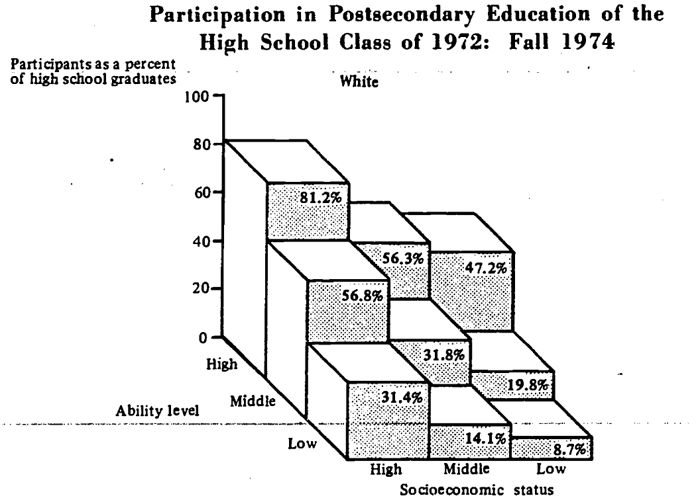
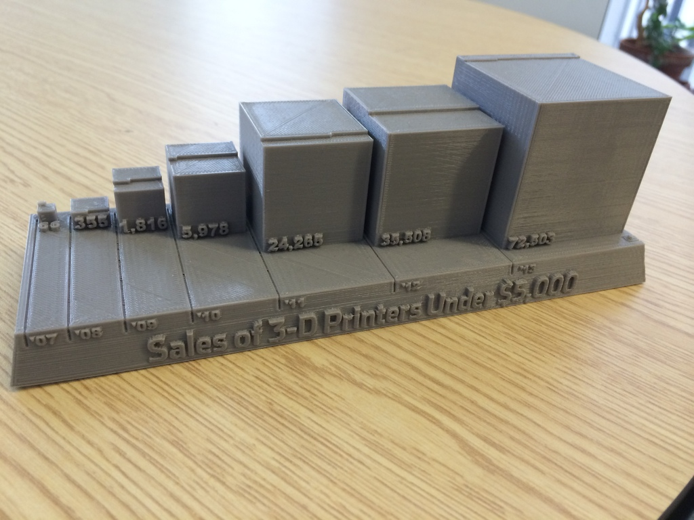
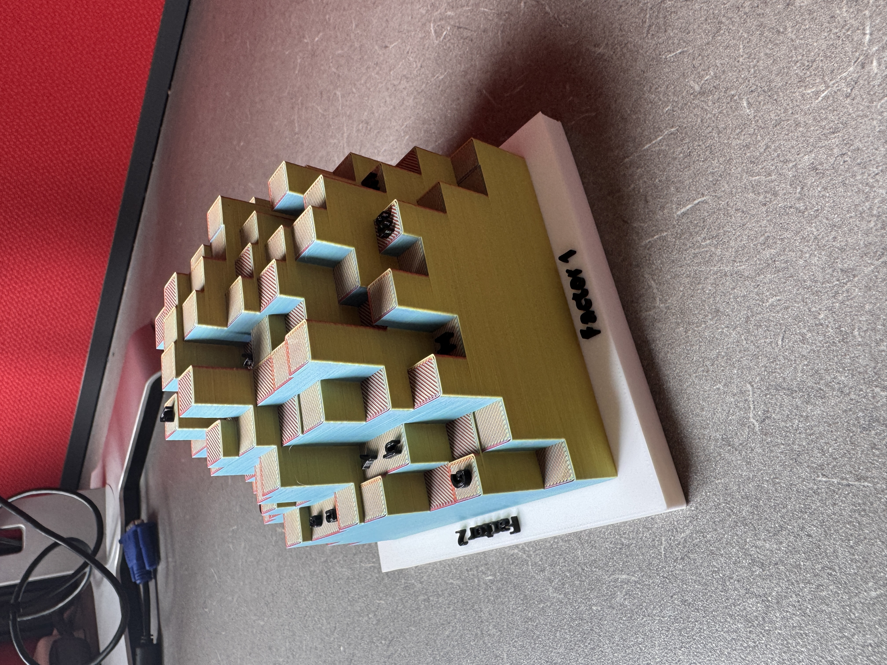
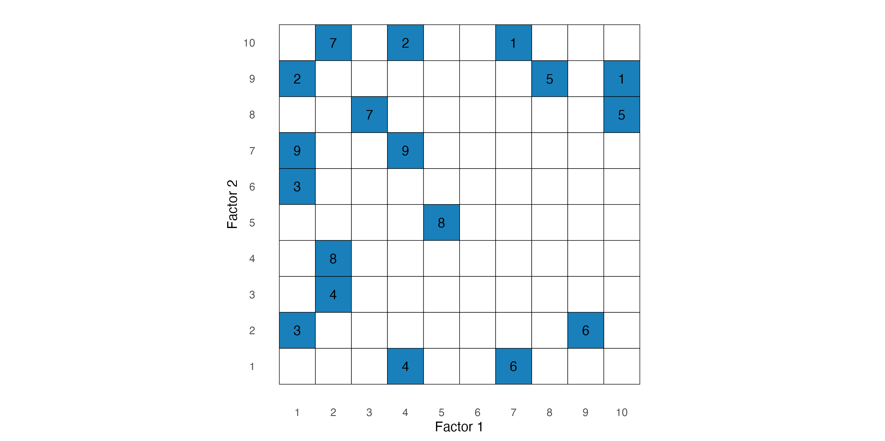
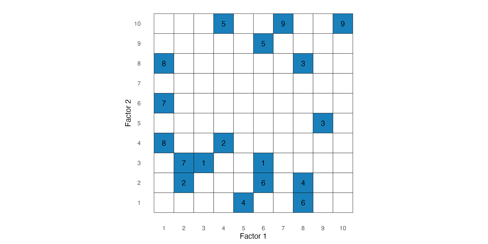
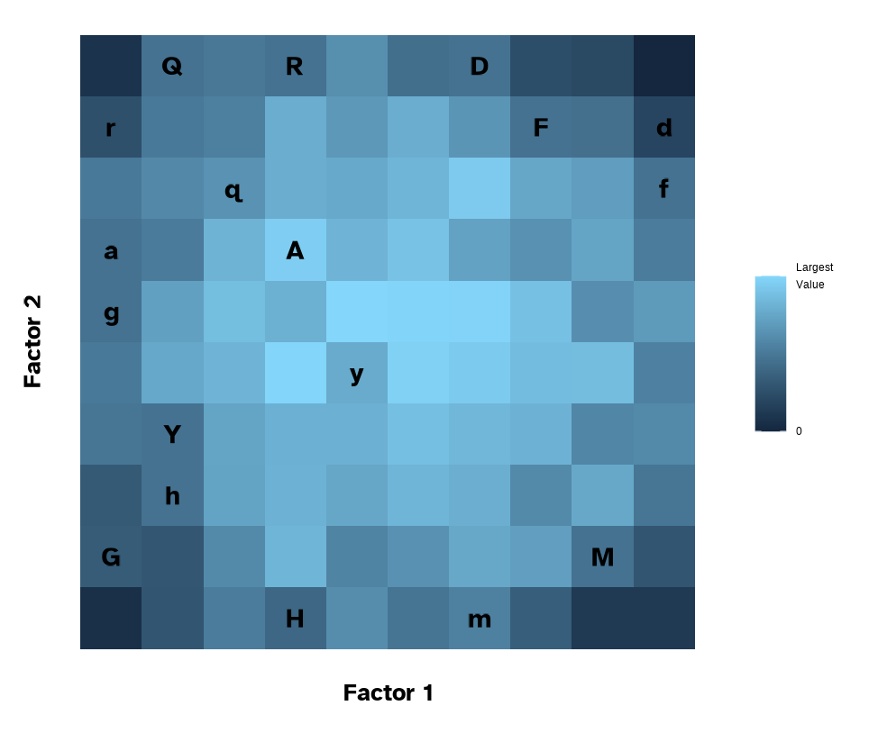
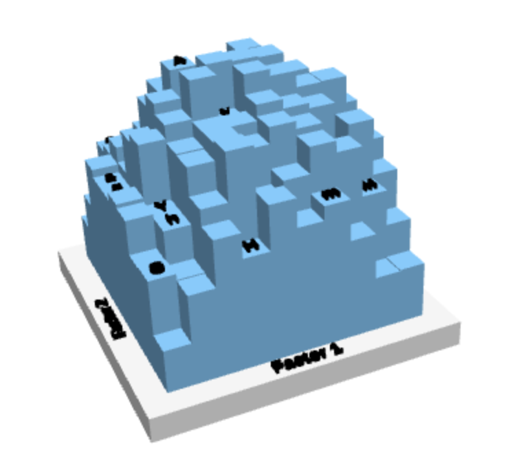
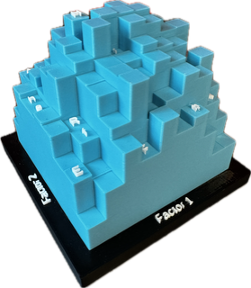
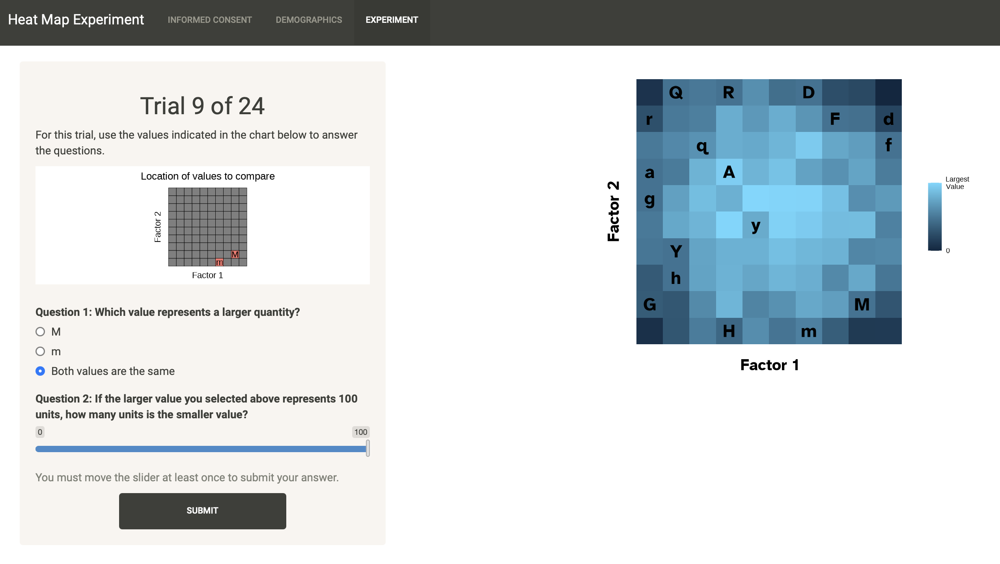
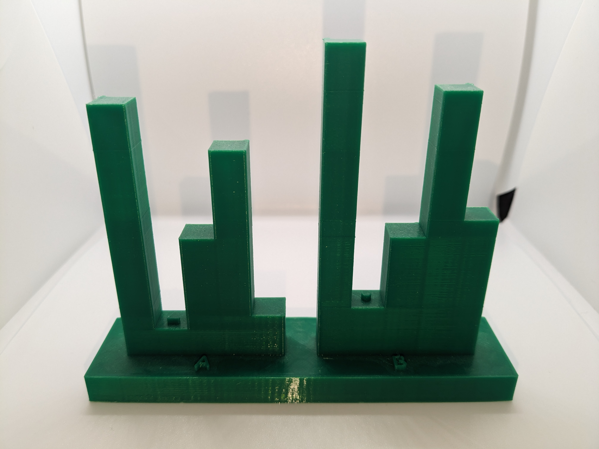

```{r}
library(tidyverse)
library(lme4)
library(lmerTest)
library(car)
library(emmeans)
load('../../data/stimuli.rda')
solutions <- readRDS('../../data/solutions.rda')
theme_set(theme_bw() + theme(aspect.ratio = 1))
```

## Outline

-   Motivation
-   Study Design
-   Results
-   Conclusions
-   Contributions and Future Work

# Motivation

## Motivation

Data is everywhere, but how do we communicate it through visualizations? We design graphics to account for:

::::::: columns
::::: column
::: incremental
-   Audience
-   Clarity
-   Accessibility
:::

::: fragment
Many types of charts exist for displaying different types of data.
:::
:::::

::: column

:::
:::::::

::: fragment
> What alternative methods can we use to better display it?
:::

## Heat maps

::::: columns
::: column
Heat maps are a type of data visualization that convey data in three dimensions.

-   Two dimensions represented by spatial coordinates

-   Other dimension (typically a continuous response variable) represented by alternative visual encoding

    -   color/fill, shading, height
:::

::: column

:::
:::::

## Data Physicalization

Many advancements in technology have allowed for greater artistic creativity in displaying data.

::::: columns
::: column
-   Physical representations of data [@huronMakingDataPhysical2023]
-   3D-printed charts
:::

::: column
{align="center"}
:::
:::::

## 3D-printed charts

What are the potential benefits of using 3D-printed charts for statistical graphics?

:::::: columns
:::: column
::: incremental
-   Increased interaction
-   Less reliance on color
-   Engagement and attention
-   Better accessibility
:::
::::

::: column
{height="15em" fig-align="center"}
:::
::::::

## Previous Research

To date, very few empirical studies have been conducted using physical 3D charts.

::: incremental
-   Physical 3D heat maps suggested to be more efficient at estimations ($n=16$) [@jansen2013]

-   Physical bar charts may be more memorable than digital charts ($n=40,16$) [@stusak2015; @stusakIfYourMind2016]

-   Some studies show smaller error rates for 3D charts using virtual reality [e.g., @kraus2020]
:::

::: fragment
> Many instances of 3D-printed charts are created for artistic representations!
:::

## Examples {.scrollable}


```{r}
#| layout-ncol: 2
#| out-height: 7em
#| out-width: auto
#| fig-cap: "Examples of 3D-printed charts"
#| fig-subcap: 
#| - "@jansen2013"
#| - "Blog post from VisWorld"
#| - "Tree map [@huronMakingDataPhysical2023]"
#| - "Wall Street Journal"
#| fig-class: center-caption
knitr::include_graphics(c(
  "images/jansen.jpg",
  "images/visworld.jpg",
  "images/treemap-3d.png",
  "images/first-3d-printed-chart.jpg"
))
```

## Overview of Our Research

Previous research suggests that 3D charts may perform better when all three dimensions are used for displaying information [@barfield1989; @fisher1997; @kraus2020].

::: fragment
> Does this hold for numerical estimations from physical 3D heat maps compared to 2D static heat maps and interactive digital 3D heat maps?
:::

::: fragment
There are many possible conditions for which charts can be rendered that could influence numerical estimations.
:::

::: fragment
> To what extent do underlying datasets and comparison types affect numerical estimations from these charts?
:::

# Methods

## Stimuli

The design of the 3D heat map experiment uses the method of constant stimuli: ratios are estimated with respect to one stimuli height that remains the same.

$$
S=\text{Stimuli}
$$

Setting 50 as the constant and 90 as the maximum, a sequence of stimuli are chosen by equally partitioning the ratios between $50/50=1$ and $50/90\approx0.556$. The same ratios are used when setting 50 as the maximum in the stimuli pair.

## Stimuli Values

```{r}
load('../../data/stimuli.rda')
load('../../data/plan.rda')
theme_set(theme_bw())
stimuli %>% 
  rowwise() %>% 
  mutate(ratio = round(min(values, constant) / max(values, constant), 2)) %>% 
  ggplot(mapping = aes(x = pair_id, y = values)) + 
  geom_bar(stat = 'identity', color = 'black', fill = '#1a80bb') +
  geom_bar(stat = 'identity', mapping = aes(y = 50), fill = '#ea801c', width = 1/2, alpha = 1/2) + 
  geom_text(aes(x = 5, y = 54), label = 'Constant') +
  geom_text(aes(x = pair_id, y = min(values)/2, label = ratio)) +
  scale_y_continuous(limits = c(0, 100)) + 
  scale_x_continuous(breaks = 1:10) +
  labs(x = 'Pair ID', y = 'Value') + 
  theme(panel.grid.major.x = element_blank(),
        panel.grid.minor.x = element_blank(),
        # axis.text.x = element_blank(),
        axis.ticks.x = element_blank(),
        axis.text = element_text(size = 14),
        axis.title = element_text(size = 18),
        aspect.ratio = 1/2)
```


## Heat Map Data

We used two datasets created using a mixture distribution for equations for spheres and random noise as a reference distribution. Final values were scaled between 0 and 100.

- Set 1: $f_1(X,Y)=\sqrt{7^2-(X-\bar{X})^2-(Y-\bar{Y})^2}$
- Set 2: $f_2(X,Y)=\sqrt{7^2+(X-\bar{X})^2+(Y-\bar{Y})^2}$

## Set 1

```{r}
library(plotly)

x <- 1:10
y <- 1:10
xbar <- mean(x)
ybar <- mean(y)

z1 <- outer(x, y, function(X, Y) {
  49 - (X - xbar)^2 - (Y - ybar)^2
})

z2 <- outer(x, y, function(X, Y) {
  49 + (X - xbar)^2 + (Y - ybar)^2
})

plot_ly(x = ~x, y = ~y, z = ~z1) %>%
  add_surface(showlegend = FALSE, showscale = FALSE)
```

## Set 2

```{r}
plot_ly(x = ~x, y = ~y, z = ~z2) %>%
  add_surface(showlegend = FALSE, showscale = FALSE)
```


## Stimuli Placement

We strategically placed stimuli so that they looked natural with respect to the simulated dataset.

```{r}
#| layout-ncol: 2
#| out-width: 95%
#| fig-subcap:
#| - "Placement of stimuli on Set 1"
#| - "Placement of stimuli on Set 2"

load('../../data/data1.rda')
load('../../data/data2.rda')
p1 <- data1 %>% 
  ggplot(mapping = aes(x = x, y = y, fill = !is.na(pair_id))) + 
  geom_tile(color = 'black') + 
  geom_text(aes(label = pair_id)) + 
  scale_fill_manual(values = c('FALSE'='white', 'TRUE'='#1a80bb')) + 
  scale_x_continuous(breaks = 1:10) + 
  scale_y_continuous(breaks = 1:10) + 
  labs(x = 'Factor 1', y = 'Factor 2') + 
  theme_minimal() + 
  theme(aspect.ratio = 1, legend.position = 'none', panel.grid = element_blank()) 

p2 <- data2 %>% 
  ggplot(mapping = aes(x = x, y = y, fill = !is.na(pair_id))) + 
  geom_tile(color = 'black') + 
  geom_text(aes(label = pair_id)) + 
  scale_fill_manual(values = c('FALSE'='white', 'TRUE'='#1a80bb')) + 
  scale_x_continuous(breaks = 1:10) + 
  scale_y_continuous(breaks = 1:10) + 
  labs(x = 'Factor 1', y = 'Factor 2') + 
  theme_minimal() + 
  theme(aspect.ratio = 1, legend.position = 'none', panel.grid = element_blank()) 

ggsave('placement-set1-2dd.png', p1)
ggsave('placement-set2-2dd.png', p2)
```


::: {layout-ncol="2"}
{height="60vh"}

{height="60vh"}
:::

## Chart Types

::: {#fig-charts layout-ncol="3"}
{#fig-2dd}

{#fig-3dd}

{#fig-3dp}

Chart types representing heat map Set 1.
:::

## Experimental Design

For a full replicate, there are $3\times2\times9=54$ treatment combinations:

-   3 media types (2dd, 3dd, 3dp)
-   2 datasets
-   9 pairs of stimuli

Way too many trials for a single participant's attention span!

::: fragment
Our main interest is the difference between media types, measured at a given ratio and dataset. To accomplish this and to reduce the number of trials per participant, we use 4 of the 9 possible stimuli pairs to create blocks.

$$
2\times3\times4=24
$$
:::

## Responses

For each trial in the experiment, we ask two question adapted from @cleveland1984.

1.  Which value in a stimuli pair represents a larger quantity?
2.  If the larger value in the stimuli pair represents 100 units, how many units is the smaller value?

::: fragment
Question 1 has three options: one for each value in the pair and one option for if the values are the same.
:::

::: fragment
Question 2 has a slider ranging from 0 to 100, and the initial position is randomly positioned
:::

------------------------------------------------------------------------

{fig-align="center"}

## Participant Recruitment

We recruited our subjects by integrating an experiential learning project into the STAT 218 curriculum at UNL. The data collection period was from Summer 2025 to Fall 2025.

For data to be collected, students had to meet the following criteria:

1.  Be at least 19 years of age
2.  Consent to participation

::: fragment
Students were instructed to complete the experiment at communal office hour locations.

-   Online sections were exempt from this, and 3D-printed charts were removed from their trials.
:::

# Results

```{r}
#| message: false
#| echo: false
#| warning: false

set.seed(3141)

# Data from Shiny app
library(RSQLite)
conn <- dbConnect(SQLite(), "../../shiny-apps/experiment-heat3d/data/stat218-summer2025.db")
# dbListTables(conn)
blocks <- dbReadTable(conn, "blocks")
exp_results <- dbReadTable(conn, "exp_results")
users <- dbReadTable(conn, "users")
dbDisconnect(conn)

# Solutions
solutions <- readRDS("../../data/solutions.rda")
load("../../data/data1.rda")
load("../../data/data2.rda")

library(tidyverse)
# Pre-processing of results
results <- exp_results %>%
  
  # Remove all practice trials
  filter(set != "practice") %>%
  
  # Arrange by user id and trial time
  group_by(user_id) %>%
  arrange(start_time) %>%
  
  # Identify sequence of trials
  mutate(user_seq = ifelse(user_trial_order > lag(user_trial_order), 0, 1),
         user_seq = ifelse(start_time == min(start_time), 0, user_seq)) %>% 
  mutate(user_seq = cumsum(user_seq)) %>%
  
  # Join with blocks
  left_join(blocks, by = "user_id", relationship = 'many-to-many') %>%
  
  # Remove blocks that were assigned after the trials started
  group_by(user_id, user_seq) %>%
  filter(system_time < min(start_time)) %>%
  
  # Get time difference with block and filter for smallest difference
  mutate(time_diff_block = min(start_time) - system_time) %>%
  filter(time_diff_block == min(time_diff_block)) %>% 
  
  # Filter so that only the first completed trial is included
  filter(user_seq == min(user_seq))

# Get user sequences with full completions
full_completions <- results %>% 
  group_by(user_id, user_seq, block) %>%
  count() %>%
  filter(n %in% c(16,24))

# Inner join to filter
results <- inner_join(results, full_completions) %>%
  select(-c(time_diff_block, n)) %>% 
  ungroup()

# Join with results and filter so that only first completed block is there
results <- left_join(results, solutions) %>% 
  ungroup() %>% 
  group_by(user_id) %>% 
  filter(system_time == min(system_time)) %>% 
  ungroup() %>% 
  filter(between(as_datetime(system_time), as_date('2025-08-01'), as_date('2025-12-31'))) %>% 
  mutate(target_ratio = 100*true_ratio,
         target_size = ifelse(z > 50, 50, z*true_ratio),
         target_diff = z-target_size)

results$pair_id <- factor(results$pair_id)

# All instances of starting the experiment
all_starts <- inner_join(blocks, users) %>% 
  filter(!str_detect(tolower(user_unique), 'test,'))

```

```{r}
# Combine users and results, remove all "test" entries
users_clean <- results %>% 
  inner_join(users, by = 'user_id', relationship = 'many-to-many') %>% 
  select(user_id, user_age:user_unique) %>% 
  distinct() %>% 
  dplyr::filter(!str_detect(tolower(user_unique), 'test,'))
```

```{r}
# Get in-person users (have at least 1 3dp trial)
users_in_person <- users_clean %>% 
  inner_join(results) %>% 
  group_by(user_id, media) %>% 
  summarise(n = n()) %>% 
  filter(media == '3dp' & n > 0) %>% 
  select(user_id)
```

```{r}
res_q1 <- results %>% 
  inner_join(users_clean, by = 'user_id') %>% 
  mutate(q1 = case_when(
    user_larger == 'Both values are the same' ~ 'Equal',
    (user_larger != true_larger) & (user_larger != 'Both values are the same') ~ 'Smaller',
    user_larger != 'Both values are the same' & user_larger == true_larger ~ 'Larger'
  ), correct_label = ifelse(user_larger == true_larger, '*', NA)) %>%
  mutate(q1_label = factor(q1, labels = c('Smaller value\n(or incorrect)', 
                                          'Equal', 'Larger value'), 
                           levels = c('Smaller', 'Equal', 'Larger'), ordered = T),
         prop = round(100*true_ratio,1),
         facet_label = paste0('Stimuli Pair ', pair_id, ' (', prop, '%)'),
         q1 = factor(q1, levels = c('Smaller', 'Equal', 'Larger'), ordered = F))

res_q1_filtered <- res_q1 %>% 
  filter(pair_id != 5) %>% 
  group_by(user_id) %>% 
  summarize(n_trials = n(),
            n_correct = sum(user_larger == true_larger),
            p.value = pbinom(n_correct, size = n_trials, prob = 2/3, lower.tail = F)) %>% 
  ungroup() %>% 
  filter(p.value <= 0.05)

res_q2 <- results %>%
  mutate(q2_error = user_slider - target_ratio,
         q2_error_cm = log2(abs(user_slider - target_ratio) + 1/8))
res_q2_filtered <- res_q2 %>% inner_join(res_q1_filtered)
```

## Demographics

`r nrow(users_clean)` students completed the entirety of the experiment. Of these, `r nrow(users_clean)-nrow(users_in_person)` students were enrolled in online sections of the course.

```{r}
#| fig-align: 'center'
#| out-height: 100%

library(kableExtra)
tbl_gender <- users_clean %>% 
  group_by(user_gender) %>% 
  summarize(n = n()) %>% 
  ungroup() %>% 
  mutate(prop = n/sum(n)) %>% 
  mutate(user = user_gender)
ggplot(tbl_gender, mapping = aes(x = user_gender, y = n)) + 
  geom_col(fill = '#1a80bb', color = 'black') + 
  geom_text(aes(label = n, y = n + 5)) + 
  labs(x = 'Gender', y = 'Count', title = 'Participant Gender') + 
  theme_bw() + 
  theme(aspect.ratio = 1/2,
        panel.grid.major.x = element_blank(),
        plot.title = element_text(face = 'bold', hjust = 0.5))
```

------------------------------------------------------------------------

```{r}
#| fig-align: 'center'
#| out-height: 100%
tbl_age <- users_clean %>% 
  group_by(user_age) %>% 
  summarize(n = n()) %>% 
  ungroup() %>% 
  mutate(prop = n/sum(n)) %>% 
  mutate(user = user_age) %>% 
  bind_rows(data.frame(
    user_age = '31-35',
    n = 0,
    prop = 0
  ))

ggplot(tbl_age, mapping = aes(x = user_age, y = n)) + 
  geom_col(fill = '#1a80bb', color = 'black') + 
  geom_text(aes(label = n, y = n + 10)) + 
  labs(x = 'Age', y = 'Count', title = 'Participant Age Category') + 
  theme_bw() + 
  theme(aspect.ratio = 1/2,
        panel.grid.major.x = element_blank(),
        plot.title = element_text(face = 'bold', hjust = 0.5))
```

------------------------------------------------------------------------

```{r}
#| fig-align: 'center'
#| out-height: 100%
tbl_education <- users_clean %>% 
  group_by(user_education) %>% 
  summarize(n = n()) %>% 
  ungroup() %>% 
  mutate(prop = n/sum(n)) %>% 
  mutate(user = user_education) %>% 
  mutate(user_education = factor(
    user_education,
    levels = c(
      'High School or Less',
      'Some Undergraduate Courses',
      'Undergraduate Degree',
      'Some Graduate Courses',
      'Graduate Degree',
      'Prefer not to answer'
    )
  ))

ggplot(tbl_education, mapping = aes(x = user_education, y = n)) + 
  geom_col(fill = '#1a80bb', color = 'black') + 
  geom_text(aes(label = n, y = n + 10)) + 
  labs(x = 'Education', y = 'Count', title = 'Participant Education Category') + 
  theme_bw() + 
  theme(aspect.ratio = 1/2,
        panel.grid.major.x = element_blank(),
        plot.title = element_text(face = 'bold', hjust = 0.5),
        axis.text.x = element_text(angle = 30, hjust = 1))
```

## Completion Times

```{r}
#| fig-cap: "Histogram of experiment completion times. Online participants had generally shorter completion times due to a decreased number of trials."
#| label: fig-total-time
#| fig-align: center


df_time <- res_q2 %>% 
  group_by(user_id, block) %>% 
  summarise(total_time = (max(end_time)-min(start_time))/60)

median_time_in_person <- df_time %>% filter(user_id %in% users_in_person$user_id) %>% 
  pull(total_time) %>% 
  median()

median_time_online <- df_time %>% filter(!(user_id %in% users_in_person$user_id)) %>% 
  pull(total_time) %>% 
  median()

df_time %>% 
  mutate(inperson = user_id %in% users_in_person$user_id) %>% 
  ggplot(mapping = aes(x = total_time, fill = inperson)) + 
  geom_histogram(binwidth = 1, boundary = 0, color = 'black') + 
  labs(x = 'Total time\n(in minutes)', y = 'Count', fill = 'Section') + 
  scale_fill_manual(values = c('TRUE'='#1a80bb', 'FALSE' = '#b8b8b8'),
                    labels = c('In-person','Online')) + 
  theme_bw() + 
  theme(aspect.ratio = 1/2)
```

## Careless Respondents

```{r}
#| fig-width: 6
#| fig-height: 4
#| fig-dpi: 600
#| fig-cap: "Three potential estimation strategies from participants. Many participants followed instructions to estimate ratios. However, some participants appeared to estimate the difference between stimuli pairs or submitted random values."
#| label: fig-user-strategies

# results %>% 
#   group_by(user_id) %>% 
#   summarize(corr_ratio = cor(user_slider, target_ratio)) %>% 
#   arrange(-corr_ratio)

results %>% 
  filter(user_id %in% c(
    '773966d68f5e13e119b6d13c8f16a68e', #Ratio
    '9fd7c7ca2fa26afd0b2ab532442a27c0', #Diff
    '78ec9b96ed3ccdd7c796dd2010aebd5b'  #Random
  )) %>% 
  mutate(strategy = case_when(
    user_id == '773966d68f5e13e119b6d13c8f16a68e' ~ 'Ratio Strategy',
    user_id == '9fd7c7ca2fa26afd0b2ab532442a27c0' ~ 'Difference Strategy(?)',
    user_id == '78ec9b96ed3ccdd7c796dd2010aebd5b' ~ 'Random Strategy'
  )) %>% 
  mutate(target = case_when(
    user_id == '773966d68f5e13e119b6d13c8f16a68e' ~ target_ratio,
    user_id == '9fd7c7ca2fa26afd0b2ab532442a27c0' ~ target_diff,
    user_id == '78ec9b96ed3ccdd7c796dd2010aebd5b' ~ 50
  )) %>% 
  ggplot(mapping = aes(x = user_trial_order, y = user_slider, group = user_id)) + 
  geom_col(aes(y = 100, fill = media), alpha = 1/5, color = NA, width = 1) + 
  geom_line(aes(linetype = 'user'), alpha = 1) + facet_wrap(~strategy, scales = 'free_x', nrow = 2) + 
  geom_point(aes(shape = user_larger == true_larger)) + 
  scale_x_continuous(breaks = seq(1,24, by = 4)) +
  geom_line(aes(y = target, linetype = 'suspect'), alpha = 2/3) +
  geom_line(aes(y = target_ratio, linetype = 'target'), alpha = 2/3) +
  scale_linetype_manual(labels = c('User response', 'True target', 'Suspected target'),
                        values = c('user'='solid','suspect'='dotted','target'='dashed'),
                        breaks = c('user', 'target', 'suspect')) +
  scale_shape_manual(values = c('TRUE' = 16, 'FALSE' = 4), labels = c('Incorrect', 'Correct')) +
  labs(x = 'Trial Number', y = 'Slider Position\n(0 - 100)',
       fill = 'Chart Type', linetype = 'Strategy', shape = 'Larger value\nidentified correctly') + 
  theme_bw() + 
  theme(panel.grid.major.x = element_blank(), panel.grid.minor.x = element_blank())
```

## How to deal with careless respondents?

While careless respondents are an acknowledged issue, there is no general consensus on how to handle them.

-   Preventative actions (attention checks, etc.)
-   Post-hoc analysis (removal, mixture models, etc.)

::: fragment
Our first question was actually designed as a quasi-attention check! For each participant, we calculate p-values using a one-sided Binomial test:

$$
H_0: \pi\leq2/3\text{ vs. }H_1:\pi>2/3
$$

where $\pi$ is the probability of correctly guessing the larger value.
:::

::: fragment
> Was this participant answering Q1 correctly at least twice as often as incorrect options?
:::

::: notes
This test removed the instances where the values were the same size.
:::

------------------------------------------------------------------------

```{r}
#| label: fig-q1-eda
#| fig-cap: "Proportion of correct responses to Question 1 with all participants"
#| fig-align: 'center'
#| out-width: 100%

res_q1 %>% 
  ggplot(mapping = aes(y = media, fill = q1_label)) + 
  geom_bar(position = position_fill()) + 
  labs(x = 'Proportion', y = 'Media type', fill = 'Participant Selection', title = 'All participants') + 
  facet_wrap(~facet_label) + 
  scale_fill_manual(values = c(
    'Larger value' = '#2066a8',
    'Equal' = '#3594cc',
    'Smaller value\n(or incorrect)' = '#8cc5e3'
  )) + 
  theme_bw() + 
  theme(aspect.ratio = 1/3,
        panel.grid = element_blank(),
        legend.position = 'bottom',
        plot.title = element_text(face = 'bold', hjust = 0.5))
```

------------------------------------------------------------------------

```{r}
#| label: fig-q1-eda2
#| fig-cap: "Proportion of correct responses to Question 1 without random guessers"
#| fig-align: 'center'
#| out-width: 100%
res_q1 %>% 
  inner_join(res_q1_filtered) %>% 
  ggplot(mapping = aes(y = media, fill = q1_label)) + 
  geom_bar(position = position_fill()) + 
  labs(x = 'Proportion', y = 'Media type', fill = 'Participant Selection', title = 'Participants without random guessers') + 
  facet_wrap(~facet_label) + 
  scale_fill_manual(values = c(
    'Larger value' = '#2066a8',
    'Equal' = '#3594cc',
    'Smaller value\n(or incorrect)' = '#8cc5e3'
  )) + 
  theme_bw() + 
  theme(aspect.ratio = 1/3,
        panel.grid = element_blank(),
        legend.position = 'bottom',
        plot.title = element_text(face = 'bold', hjust = 0.5))
```

## Analyzing Error

We calculate error as follows:

$$
y=\log_2(|\text{User Response}-100\times(\text{True ratio})|+1/8)
$$

We excluded:

-   suspected random guessers
-   stimuli pair where values were the same
-   estimates where Q1 were incorrect

::: fragment
Various models produced the same conclusions!
:::

## Linear Mixed Model

```{r}
mod_q2 <- lmer(q2_error_cm ~ set*media*pair_id + (1|user_id:block/set:media),
               data = filter(res_q2_filtered, pair_id != 5 & user_larger==true_larger))
mod_q2_anova <- car::Anova(mod_q2, type = 3, test = 'F')
p.vals_mod2 <- mod_q2_anova$`Pr(>F)`
```

```{r}
#| echo: false
em <- emmeans(mod_q2, ~media, infer = c(T,T))
diffs <- pairs(em, infer = c(T,T))
df_diffs <- data.frame(diffs)
# diffs
```

$$
Y_{ijklm}=\mu+S_i\times M_j\times P_k+\gamma_{lm}+\omega_{ijlm}+\epsilon_{ijklm}
$$

where

-   $Y=\log_2(|\text{User Response}-100\times(\text{True ratio})|+1/8)$
-   $\mu$ is the intercept
-   $S_i\times M_j \times P_k$ is the fixed effects (and interactions) of **S**et, **M**edia type, and stimuli **P**air
-   $\gamma_{lm}$ is the random effect of participant and block
-   $\omega_{ijklm}$ is the random effect of media and set for each participant
-   $\epsilon_{ijklm}$ is the random error
-   All random effects i.i.d. $N(0,\sigma^2)$ with separate $\sigma^2$ and are independent

------------------------------------------------------------------------

```{r}
knitr::kable(mod_q2_anova, caption = 'ANOVA Table', digits = 3)
```

------------------------------------------------------------------------

```{r}
#| label: fig-em-media
#| fig-cap: "Distributions of log error overlaid with estimated marginal means and their 95% confidence intervals. Differences were only detected between the 2D heat map and both types of 3D heat maps, where the 2D heat map had evidence of larger errors."
#| out-height: 100%
library(ggsignif)
res_q2_filtered %>% 
  ggplot(mapping = aes(x = media)) + 
  geom_violin(aes(y = q2_error_cm), fill = '#1a80bb') + 
  geom_point(aes(y = emmean),
           data = data.frame(em), size = 1) + 
  geom_errorbar(aes(ymin = lower.CL, ymax = upper.CL),
                data = data.frame(em), width = 1/10) + 
  geom_signif(
    aes(y = emmean),
    data = data.frame(em),
    comparisons = list(c('2dd', '3dd'), c('2dd', '3dp')),
    margin_top = 0.1,
    step_increase = 0.1,
    tip_length = 0.05,
    map_signif_level = function(p) '***'
  ) + 
  labs(x = 'Chart Type', y = 'log2(|Error|+1/8') + 
  scale_y_continuous(limits = c(-3.2, 9.5), breaks = seq(-5, 15, by = 2.5)) +
  theme_bw() + 
  theme(aspect.ratio = 1/2, panel.grid.major.x = element_blank())

```

------------------------------------------------------------------------

```{r}
#| label: fig-em-media2
#| fig-cap: "Estimated marginal means for media types and their 95% confidence intervals. "
#| out-height: 100%
library(ggsignif)
data.frame(em) %>% 
  ggplot(mapping = aes(x = media)) + 
  geom_col(aes(y = emmean), fill = '#1a80bb',
           width = 1/2) + 
  geom_errorbar(aes(ymin = lower.CL, ymax = upper.CL),
                data = data.frame(em), width = 1/10) + 

  labs(x = 'Chart Type', y = 'log2(|Error|+1/8)') + 
  # scale_y_continuous(limits = c(0, 5)) +
  theme_bw() + 
  theme(aspect.ratio = 1/2, panel.grid.major.x = element_blank())

```

------------------------------------------------------------------------

```{r}
em2 <- emmeans(mod_q2, ~pair_id + set)
# em2
```

```{r}
#| eval: false
pairs(em2) %>% 
  data.frame() %>% 
  separate(contrast, into = c('p1','p2'), sep = ' - ') %>% 
  pivot_longer(cols = c(p1, p2)) %>% 
  filter(p.value <= 0.05) %>% 
  group_by(value) %>% 
  count() %>% 
  arrange(-n)
```

```{r}
pairs2 <- pairs(em2) %>% 
  data.frame() %>% 
  filter(p.value < 0.05) %>% 
  arrange(p.value)
```

```{r}
#| fig-cap: "Estimated marginal means of stimuli pair and dataset. Bars sharing the same letter are not significantly different from one another."
#| label: fig-em-set-pair
#| fig-align: center


multcomp::cld(em2, Letters = letters) %>% 
  data.frame() %>% 
  left_join(mutate(solutions, pair_id = as.factor(pair_id))) %>% 
  mutate(label = paste0('Pair ', pair_id, '\n(', round(100*true_ratio, 1), '%)')) %>% 
  ggplot(mapping = aes(x = reorder(label, true_ratio), y = emmean)) + 
  labs(x = '', y = 'Estimated Marginal Mean\nlog2(|Error| + 1/8)', fill = 'Dataset') +
  geom_col(aes(fill = set), position = position_dodge(), width = 2/3) + 
  geom_text(aes(label = trimws(.group), y = 0.2, color = set), position = position_dodge(2/3),
            angle = 0,
            hjust = 0.5,
            size = 2) +
  geom_errorbar(aes(ymin = lower.CL, ymax = upper.CL, color = set),
                position = position_dodge(2/3), width = 1/4) +
  scale_color_manual(values = c('set1' = 'black', 'set2' = 'black')) +
  scale_fill_manual(values = c('set1' = '#1a80bb', 'set2'='#8cc5e3')) + 
  guides(color = 'none') +
  theme_bw() + 
  theme(aspect.ratio = 1/2, panel.grid.major.x = element_blank())
```

## Time per trial

```{r}

time <- res_q2_filtered %>% 
  ungroup() %>% 
  mutate(ttc = end_time - start_time)
clicks <- res_q2_filtered %>% 
  filter(media == '3dd')

over_60 <- time %>% 
  filter(ttc >=60) %>% 
  group_by(user_id, block) %>% 
  count() %>% 
  arrange(-n)

```

```{r}
#| fig-cap: "Visual summary of time spent on each trial. 137 trials are omitted due to lasting longer than 60 seconds."
#| fig-subcap:
#| - "Frequency plot"
#| - "Time vs. Error"
#| label: fig-time-summary
#| fig-align: center
#| layout-ncol: 2
#| out-width: 90%
time %>% 
  ggplot(mapping = aes(x = ttc, color = media)) + 
  geom_density() + 
  scale_x_continuous(limits = c(0, 60)) + 
  labs(x = 'Time spent per trial\n(in seconds)',
       color = 'Chart type') + 
  theme_bw() + 
  theme(aspect.ratio = 1/2)
  
time %>% 
  ggplot(mapping = aes(x = ttc, y = q2_error_cm, color = media)) + 
  geom_point(alpha = 1/10) + 
  geom_smooth() +
  scale_x_continuous(limits = c(0, 60)) + 
  labs(x = 'Time spent per trial\n(in seconds)',
       y = 'log2(|Error|+1/8)',
       color = 'Chart type') + 
  theme_bw() + 
  theme(aspect.ratio = 1/2)
```

## Interactions with digital 3D heat map

```{r}
#| layout-ncol: 2
#| label: fig-clicks3dd
#| fig-align: center
#| out-width: 90%
#| fig-cap: "Participant interactions with the digital 3D heat maps."
#| fig-subcap: 
#| - "Histogram"
#| - "WebGL clicks vs. Error"
clicks %>% 
  ggplot(mapping = aes(x = clicks_3dd)) + 
  geom_histogram(binwidth = 1, color = 'black', fill = '#1a80bb',
                 boundary = 0) + 
  theme_bw() + 
  theme(aspect.ratio = 1/2) + 
  labs(x = 'Number of WebGL clicks',
       y = 'Count of clicks')

clicks %>% 
  ggplot(mapping = aes(x = clicks_3dd, y = q2_error_cm)) + 
  geom_point(position = position_jitter(width = 1/5, height = 0), alpha = 1/10) + 
  geom_smooth() +
  # scale_x_log10() +
  theme_bw() + 
  theme(aspect.ratio = 1/2) + 
  labs(x = 'Number of WebGL clicks',
       y = 'log2(|Error|+1/8)')
```

## Interactions with the slider

```{r}
#| layout-ncol: 2
#| label: fig-slider-clicks
#| fig-cap: "Participant interactions with the slider."
#| fig-subcap: 
#| - "Histogram"
#| - "Slider clicks vs. Error"
#| out-width: 90%
res_q2_filtered %>% 
  ggplot(mapping = aes(x = slider_clicks)) + 
  geom_histogram(binwidth = 1, fill = '#1a80bb', color = 'black') + 
  theme_bw() + 
  labs(x = 'Number of slider clicks', y = 'Count') + 
  theme(aspect.ratio = 1/2)

res_q2_filtered %>% 
  ggplot(mapping = aes(x = slider_clicks, y = q2_error_cm)) + 
  geom_point(position = position_jitter(width = 1/5, height = 0), alpha = 1/10) +
  geom_smooth() +
  labs(x = 'Number of slider clicks', y = 'log2(|Error|+1/8') + 
  theme_bw() + 
  theme(aspect.ratio = 1/2)
```

## Initial Placement of Slider

For each trial, the slider was randomly positioned between 0 and 100.

```{r}
#| label: fig-slider-start
#| fig-cap: "Effect of initial slider position on the submitted slider value. "
res_q2_filtered %>% 
  ggplot(mapping = aes(x = slider_start, y = user_slider)) + 
  geom_point(alpha = 1/10) +
  labs(x = 'Initial slider position', y = 'Submitted slider value') + 
  geom_smooth() +
  theme_bw() + 
  theme(aspect.ratio = 1/1)
```

# Conclusions and Future Work

## Main findings

We note the following results:

-   Digital and physical 3D heat maps produced lower error than 2D heat maps
-   No detectable differences between digital and physical 3D heat maps
-   Differences attributed to dataset and stimuli pair

## Areas for future work

As one of the first studies to empirically evaluate physical 3D charts, there are many areas left to explore.

::: incremental
-   Colors and fills of 2D and 3D heat maps
-   Just noticeable differences
-   Types of estimations ($A/B$, $A/(A+B)$, $B-A$, etc.)
-   Development of tools to produce 3D charts with considerations for 3D printing
:::

# Contributions to literature

## Contributions

**Study 1**: Partial replication of @cleveland1984 to compare digital and physical representations of bar charts.

> No significant differences in ratio estimations detected from type of chart ($n=38$)

{out-height="100%" fig-align="center"}

## Contributions

**Study 2**: Students completed a series of reflections regarding their participation in the experiment.

> What information do students learn from participating in an experiment, both as participants and consumers of scientific knowledge?

> Many students connected ideas from the course material! (e.g., variable identification and generalizability)

## Contributions

**Study 3**: taking inspiration from @cleveland1984 and Study 1, we extend our scope to use heat maps.

> When all dimensions are used for conveying information, 3D heat maps produced lower error rates for estimations of ratios than 2D heat maps.

> No detectable differences between digital and physical 3D heat maps.

# Questions?

# Appendix

## Multiple Models

```{r}
# Format: mod_(participant)_(response)

# All participants
mod_all_all <- lmer(q2_error_cm ~ set*media*pair_id + (1|user_id:block/set:media),
     data = filter(res_q2, pair_id != 5))
mod_all_q1 <- lmer(q2_error_cm ~ set*media*pair_id + (1|user_id:block/set:media),
     data = filter(res_q2, pair_id != 5 & user_larger == true_larger))

# Filtered participants
mod_q1_all <- lmer(q2_error_cm ~ set*media*pair_id + (1|user_id:block/set:media),
     data = filter(res_q2_filtered, pair_id != 5))
mod_q1_q1 <- lmer(q2_error_cm ~ set*media*pair_id + (1|user_id:block/set:media),
     data = filter(res_q2_filtered, pair_id != 5 & user_larger == true_larger))


```

```{r}
#| eval: true
bind_rows(
  car::Anova(mod_all_all, type = 3, test = 'F') %>% 
  data.frame() %>% 
  janitor::clean_names() %>% 
  rownames_to_column('effect'),
  car::Anova(mod_all_q1, type = 3, test = 'F') %>% 
  data.frame() %>% 
  janitor::clean_names() %>% 
  rownames_to_column('effect'),
  car::Anova(mod_q1_all, type = 3, test = 'F') %>% 
  data.frame() %>% 
  janitor::clean_names() %>% 
  rownames_to_column('effect'),
  car::Anova(mod_q1_q1, type = 3, test = 'F') %>% 
  data.frame() %>% 
  janitor::clean_names() %>% 
  rownames_to_column('effect'),
  .id = 'model'
) %>% 
  filter(effect != '(Intercept)') %>% 
  select(model, effect, pr_f) %>% 
  pivot_wider(names_from = effect, values_from = pr_f) %>% 
  mutate(across(where(is.numeric), round, 3)) %>% 
  mutate(model = case_when(
    model=='1' ~ 'All participants, all responses',
    model=='2' ~ 'All participants, Q1 correct',
    model=='3' ~ 'Filtered participants, all responses',
    model=='4' ~ 'Filtered participants, Q1 correct'
  )) %>% 
  column_to_rownames('model') %>% 
  t() %>% 
  as.data.frame() %>% 
  rownames_to_column('Term') %>% 
  kable(caption = 'ANOVA Table p-values for model terms', digits = 3, booktabs = T,
        label = 'tbl-all-models-anova')


# car::Anova(mod_all_all, type = 3, test = 'F')
# car::Anova(mod_all_q1, type = 3, test = 'F')
# car::Anova(mod_q1_all, type = 3, test = 'F')
# car::Anova(mod_q1_q1, type = 3, test = 'F')
```

```{r}
#| fig-height: 8
em_all_all <- emmeans(mod_all_all, ~media+set+pair_id, pbkrtest.limit = 5800)
em_all_q1 <- emmeans(mod_all_q1, ~media+set+pair_id, pbkrtest.limit = 5800)
em_q1_all <- emmeans(mod_q1_all, ~media+set+pair_id, pbkrtest.limit = 5800)
em_q1_q1 <- emmeans(mod_q1_q1, ~media+set+pair_id, pbkrtest.limit = 5800)
```

------------------------------------------------------------------------

```{r}
#| eval: true
#| label: fig-model-int1
#| fig-width: 6
#| fig-height: 6
#| fig-dpi: 600
#| fig-cap: "Interaction plots for media type and response filtering, facetted by stimuli pair and dataset."


bind_rows(
  data.frame(em_all_all),
  data.frame(em_all_q1),
  data.frame(em_q1_all),
  data.frame(em_q1_q1),
  .id = 'model'
) %>% 
  mutate(model = case_when(
    model=='1' ~ 'All participants, all responses',
    model=='2' ~ 'All participants, Q1 correct',
    model=='3' ~ 'Filtered participants, all responses',
    model=='4' ~ 'Filtered participants, Q1 correct'
  )) %>% 
  ggplot(mapping = aes(x = media, y = emmean, color = model, group = model)) + 
  geom_point(size = 1) + 
  geom_line() + 
  facet_wrap(~set+pair_id, labeller = label_both) +
  # facet_grid(set ~ pair_id) + 
  # facet_grid(pair_id ~ set) + 
  theme_bw() +
  guides(color=guide_legend(nrow=2,byrow=TRUE)) + 
  theme(aspect.ratio = 1/2,
        legend.position = 'bottom')
```

------------------------------------------------------------------------

```{r}
#| eval: true
#| label: fig-model-int2
#| fig-width: 6
#| fig-dpi: 600
#| fig-cap: "Interaction plots for dataset and response filtering, facetted by stimuli pair and media type."


bind_rows(
  data.frame(em_all_all),
  data.frame(em_all_q1),
  data.frame(em_q1_all),
  data.frame(em_q1_q1),
  .id = 'model'
) %>% 
  mutate(model = case_when(
    model=='1' ~ 'All participants, all responses',
    model=='2' ~ 'All participants, Q1 correct',
    model=='3' ~ 'Filtered participants, all responses',
    model=='4' ~ 'Filtered participants, Q1 correct'
  )) %>% 
  ggplot(mapping = aes(x = set, y = emmean, color = model, group = model)) + 
  geom_point(size = 1) + 
  geom_line() + 
  facet_grid(media~pair_id, labeller = label_both) +
  # facet_grid(set ~ pair_id) + 
  # facet_grid(pair_id ~ set) + 
  theme_bw() +
  guides(color=guide_legend(nrow=2,byrow=TRUE)) + 
  theme(aspect.ratio = 1/1,
        strip.text.y = element_text(size = 6),
        legend.position = 'bottom')
```

------------------------------------------------------------------------

```{r}
#| eval: true
#| label: fig-model-int3
#| fig-width: 6
#| fig-dpi: 600
#| fig-cap: "Interaction plots for stimuli pairs and response filtering, facetted by dataset and media type."


bind_rows(
  data.frame(em_all_all),
  data.frame(em_all_q1),
  data.frame(em_q1_all),
  data.frame(em_q1_q1),
  .id = 'model'
) %>% 
  mutate(model = case_when(
    model=='1' ~ 'All participants, all responses',
    model=='2' ~ 'All participants, Q1 correct',
    model=='3' ~ 'Filtered participants, all responses',
    model=='4' ~ 'Filtered participants, Q1 correct'
  )) %>% 
  ggplot(mapping = aes(x = pair_id, y = emmean, color = model, group = model)) + 
  geom_point(size = 1) + 
  geom_line() + 
  facet_grid(set~media, labeller = label_both) +
  # facet_grid(set ~ pair_id) + 
  # facet_grid(pair_id ~ set) + 
  theme_bw() +
  guides(color=guide_legend(nrow=2,byrow=TRUE)) + 
  theme(aspect.ratio = 1/1,
        # strip.text.y = element_text(size = 6),
        legend.position = 'bottom')
```

## Excluding Stimuli Pair 5

```{r}
#| out-height: 100%
#| fig-cap: "Counts of response behavior for Stimuli Pair 5. This pair had identical values, which means that true solutions indicates marking that they were the same value and positioning the slider at 100."
#| fig-scap: "Response behavior for identical-value stimuli pair"
#| label: fig-pair5-issues
infilter.labs <- c('Included Participants', 'Excluded Participants')
names(infilter.labs) <- c(TRUE, FALSE)

res_q2 %>% 
  filter(pair_id == 5) %>% 
  mutate(infilter = user_id %in% res_q2_filtered$user_id) %>% 
  group_by(q1_correct = user_larger == true_larger,
           slider100 = user_slider == 100,
           infilter) %>% 
  count() %>% 
  arrange(infilter, q1_correct) %>% 
  ggplot(mapping = aes(x = slider100, y = n, fill = q1_correct)) + 
  geom_col(position = position_dodge()) + 
  geom_text(aes(label = n, y = n+8), position = position_dodge(width = 1),
            size = 3) + 
  labs(x = 'Slider position', y = 'Count',
       fill = 'Correct solution\nto Q1?') +
  facet_wrap(~infilter, labeller = labeller(infilter = infilter.labs)) + 
  scale_fill_manual(labels = c("No", "Yes"),
                    values = c('#b8b8b8', '#1a80bb')) +
  scale_x_discrete(labels = c('Not at 100', 'At 100')) + 
  theme_bw() + 
  theme(aspect.ratio = 1/2, legend.position = 'bottom')
```

## Generalized Additive Model

$$
y=\mu+S_i\times M_j + s_i^S(R)+s_j^M(R)+P_m+\epsilon
$$ {#eq-gam}

where

-   $y=\log_2(|\text{Error}|+1/8)$

-   $S_i\times M_j$ is the fixed effects for main effect and two-way interactions of dataset $S_i$ and media type $M_j$

-   $S_i^S(R)$ is a thin-plate spline function for ratio accounting for dataset

-   $S_j^M(R)$ is a thin-plate spline function for ratio accounting for media type

-   $P_m$ is the random effect of the $m^{th}$ participant

-   $\epsilon$ is random error

------------------------------------------------------------------------

```{r}
#| cache: true
# GAM
library(mgcv)
library(gratia)
mod_gam <- gam(
  q2_error_cm ~ 
    set*media + 
    s(target_ratio, k = 4, by = media) + 
    s(target_ratio, k = 4, by = set) + 
    s(user_id, bs='re'),
  method = 'REML',
  data = filter(res_q2, pair_id != 5 & user_larger == true_larger) %>% 
    mutate(set = factor(set),
           media = factor(media),
           user_id = factor(user_id))
)
gam_sum <- summary(mod_gam)

```

```{r}
#| cache: true
mod_gam_flt <- gam(
  q2_error_cm ~ 
    set*media + 
    s(target_ratio, k = 4, by = media) + 
    s(target_ratio, k = 4, by = set) + 
    s(user_id, bs='re'),
  method = 'REML',
  data = filter(res_q2_filtered, pair_id != 5 & user_larger == true_larger) %>% 
    mutate(set = factor(set),
           media = factor(media),
           user_id = factor(user_id))
)
```

## GAM (All Participants)

```{r}
anova(mod_gam)
```

------------------------------------------------------------------------

```{r}
em_gam <- emmeans(mod_gam, ~media|set + target_ratio, at = list(target_ratio = unique(res_q2$target_ratio)))
em_gam %>% 
  data.frame() %>% 
  ggplot(mapping = aes(x = factor(round(target_ratio,2)), y = emmean, color = media, group = media)) + 
  geom_point(position = position_dodge(width = 1/3)) + 
  geom_errorbar(aes(ymin = lower.CL, ymax = upper.CL, width = 1/4),
                position = position_dodge(width = 1/3)) + 
  labs(x = 'Ratio', y = 'log2(Error + 1/8)', title = 'GAM with all participants') + 
  facet_wrap(~set) + 
  theme(aspect.ratio = 1/2,
        plot.title = element_text(hjust = 0.5, face = 'bold')) + 
  scale_y_continuous(limits = c(1.9, 4.15))
```

## GAM (Filtered Participants)

```{r}
anova(mod_gam_flt)
```

------------------------------------------------------------------------

```{r}
em_gam_flt <- emmeans(mod_gam_flt, ~media|set + target_ratio, at = list(target_ratio = unique(res_q2$target_ratio)))
em_gam_flt %>% 
  data.frame() %>% 
  ggplot(mapping = aes(x = factor(round(target_ratio,2)), y = emmean, color = media, group = media)) + 
  geom_point(position = position_dodge(width = 1/3)) + 
  geom_errorbar(aes(ymin = lower.CL, ymax = upper.CL, width = 1/4),
                position = position_dodge(width = 1/3)) + 
  labs(x = 'Ratio', y = 'log2(Error + 1/8)', title = 'GAM without Random Guessers') + 
  facet_wrap(~set) + 
  theme(aspect.ratio = 1/2,
        plot.title = element_text(hjust = 0.5, face = 'bold')) + 
  scale_y_continuous(limits = c(1.9, 4.15))
```

## References

::: {#refs}
:::
