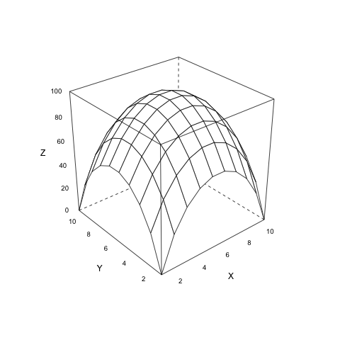
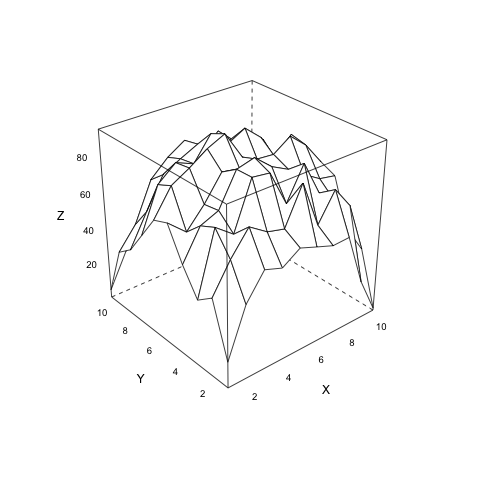
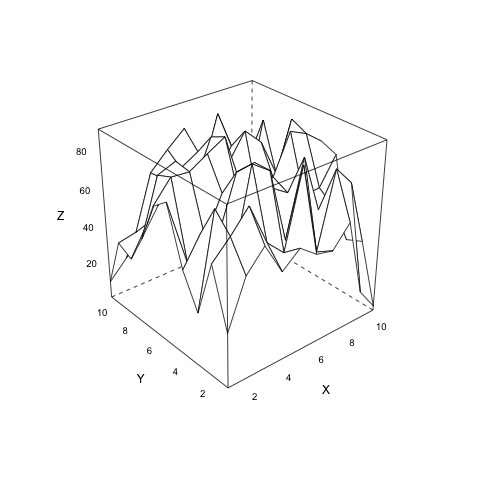
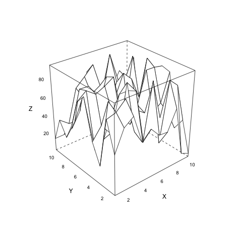
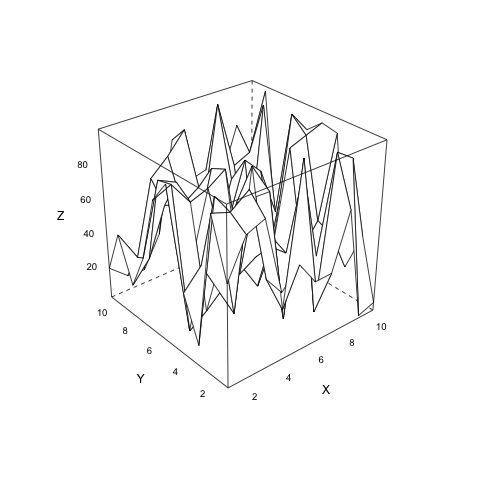
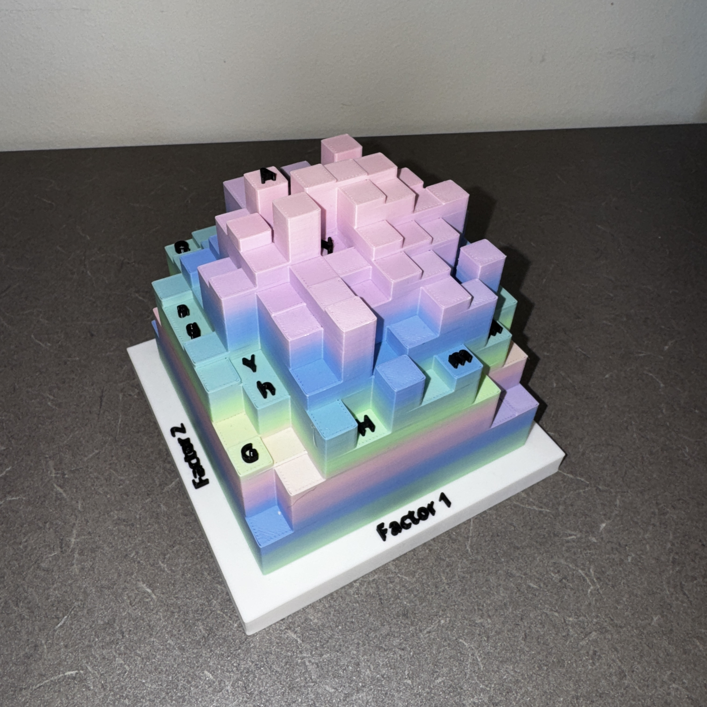
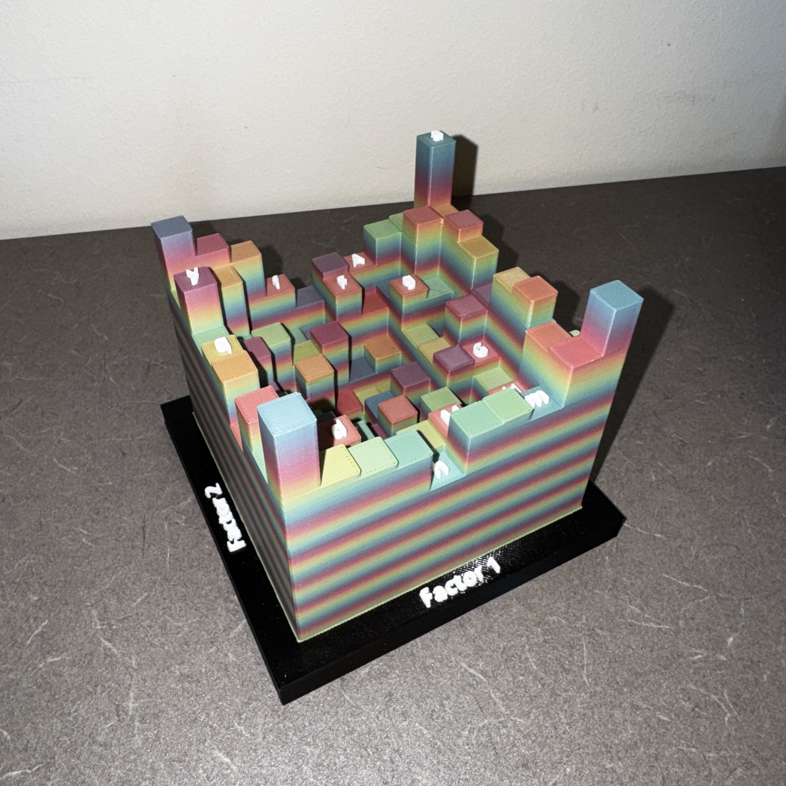
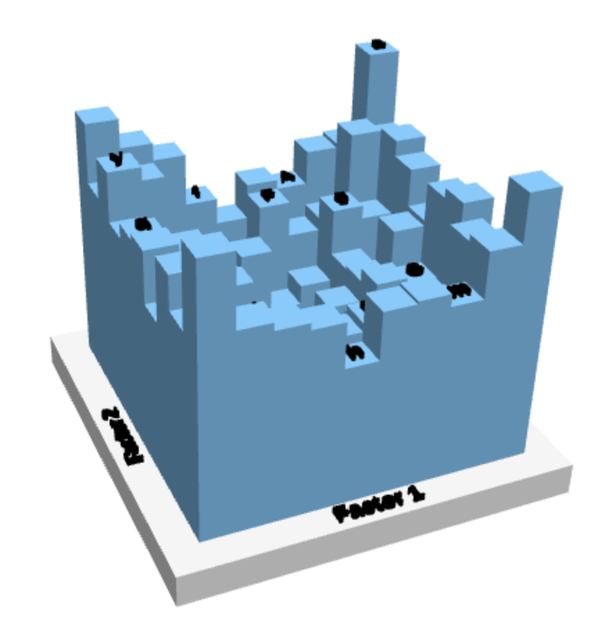
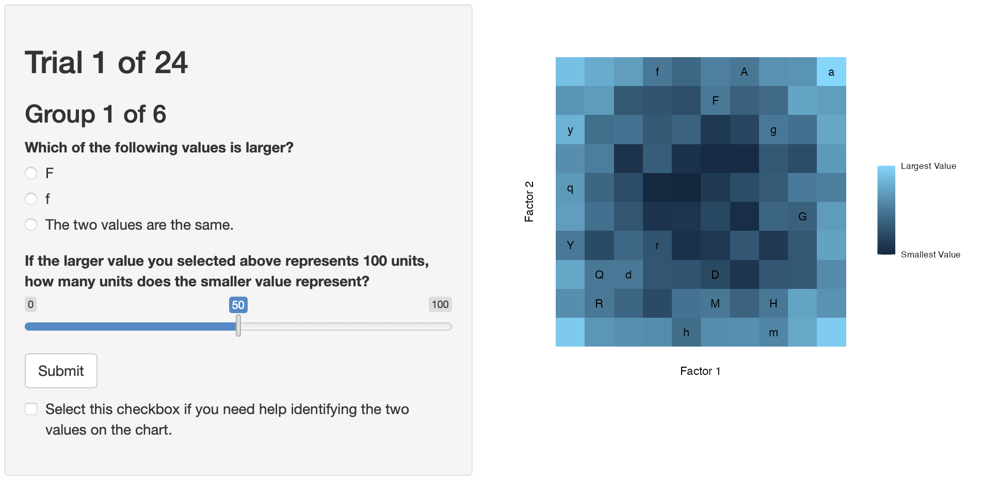

```{r}
#| message: false
#| warning: false
#| echo: false
library(tidyverse)
library(lme4)
library(lmerTest)
library(emmeans)
library(kableExtra)
```

## Introduction

In the 20th century, advancements in technology made data visualizations increasingly more affordable and accessible to a broader population. The primary change in formal data visualizations was from hand-drawn charts to computer-rendered charts [@tukey1965], and with subsequent advances in color printing and available software have allowed for data visualizations to enter other mediums. These include the ability create virtual and physical charts that effectively use the 3-dimensional (3D) world around us with the novel use of 3D-printed charts. This newer type of visualization has gained a small amount of traction in recent years as a method of producing tangible charts [@stusakIfYourMind2016; @huExploringNewParadigms2015b; @huronMakingDataPhysical2023].

In many disciplines, 3D-printed visualizations have shown mixed or promising results compared to alternative rendering formats. Although a comprehensive review of 3D-printing in scientific fields is beyond the scope of this paper, we highlight several examples of its use for visualization. @katsioloudis2018 conducted a study with engineering students and found no statistically significant difference between computer-rendered and 3D-printed models when students were asked to draw a cross-section of a dodecahedron, suggesting similar levels of spatial understanding between digital and physical representations. In contrast, other applications have highlighted advantages of 3D-printed models. For example, @holloway2019 reported positive feedback from visually impaired individuals when 3D-printed maps were used to support navigation. Similarly, in clinical education, @muff2022 found that 3D-printed anatomical structures were well accepted alongside VR glasses and 3D computer renderings. As 3D-printed visualizations become increasingly common across scientific fields, we explore their potential use in communicating statistical graphics.

At this time, there are few studies that evaluate 3D-printed charts for the purpose of displaying statistical information [@jansen2013; @stusak2015; @stusakIfYourMind2016; @huExploringNewParadigms2015b]. This may in part be due to the cost of materials and rendering times as compared to charts produced on a computer. A single chart can take up to a day to print, limiting the ability to quickly produce visualizations. Additionally, there are few options for producing such charts from statistical software. In R, the `rgl` package [@rgl] can export STL files that can be used by 3D-printing software, and similarly for the `rayshader` package [@rayshader]. However, these options are not optimized for essential considerations required of 3D-printed charts, such as embossed labels. Given the nature of 3-dimensional data, viewing a 3D realization of statistical information in a 3D environment is a realistic scenario that could increase the ability for information extraction.

### Literature Review

Using an identical dataset across multiple chart types does not ensure that the data is perceived in the same way [@cleveland1984; @hofmann2012; @vanderplas2020]. One of the main factors in this phenomenon is how data is encoded into the chart. These encodings include, but are not limited to, placement along axes, lengths, areas, volumes, and color scales. For example, bar charts and pie charts are two common visualizations that have long been the topic of debate [@eells1926; @croxton1927; @cleveland1984; @spence1989]. Bar charts are constructed with the encodings of length, position, and area. In contrast, pie charts make use of arc lengths, angles, and area. Inherently, the comparison of different chart types is a comparison of encodings due to the changes in how data is being displayed.

@cleveland1984 noted that estimates involving numerical accuracy may decrease when increasing dimensionality of the encoding, although this was not formally tested in their experiments. Their reasoning was due to Stevens' power law, a mathematical formulation of how magnitudes are perceived given different stimuli sources [@stevens1986]. The general form of the law is $\psi(I)=kI^\alpha$, where $I$ is the magnitude of a stimulus, $\psi(I)$ is the perceived magnitude, $k$ is a proportionality constant from the unit of the stimulus, and $\alpha$ is the exponent from the type of stimuli used. Studies have estimated that lengths are perceived without bias (i.e., $\alpha=1$), but areas and volumes tend to have skewed perceptions [@cleveland1984]. This indicates that lower-dimensional charts may perform better when readers are tasked with extracting numerical estimates from the chart, although this has been a topic of debate in the last several decades.

There are mixed results in regard to the use of 3D charts, mostly attributable to the use of the third dimension. When the extra dimension does not convey meaningful information, estimates of accuracy decrease and solution times increase as compared to equivalent 2D charts [@fisher1997; @zacks1998; @fischer2000]. The same increase in solution time is seen when the third dimension is utilized for displaying data, but can sometimes produce better error rates than 2D charts [@barfield1989; @kraus2020]. Additionally, when given the option of 2D or 3D charts for extracting numerical information, the 2D charts showed increased preference and confidence than their 3D counterparts [@barfield1989; @fisher1997]. It is worth noting that all of these studies use 2D or virtual reality renderings of 3D charts and not physical 3D charts.

Many studies that assess 3D charts use computer-rendered displays that leverage high levels of precision in their output. Digital renderings allow for exact control over visual properties, whereas physical charts are subject to factors such as chart materials, lighting conditions, interactivity, and viewing distance. Some of these factors have already been suggested to have a measureable effect within computer renderings [@tarr2001; @wang2022]. While virtual reality can offer similar interactions with 3D objects compared to the real world, perceptual judgements can be distorted in virtual environments [@kelly2018; @park2021]. The result is that many findings for the perception of 3D statistical graphics are limited to the method in which they were rendered.

To date, few empirical studies have investigated 3D-printed charts, and it is unclear if they follow the framework of existing theories on data visualizations. One of the first studies to examine digital and physical renderings primarily focused on information retrieval times, where physical 3D heatmaps had lower completion times than digitized 2D and 3D alternatives [@jansen2013]. In their study, error rates were also collected, but had small effect sizes due to the 2D, digital 3D, and physical 3D charts. Other studies on physical statistical graphics tend to focus on bar charts, where the third dimension is not used for information. Physical 3D bar charts are suggested to have conditionally improved memorability, subject to specific datasets [@stusak2015; @stusakIfYourMind2016]. @huExploringNewParadigms2015b discussed the construction of 3D-printed bar charts with accessibility features, though these designs do not appear to have been empirically evaluated.

We hypothesize that 3D charts in 3D environments will produce better information extraction than their computer-rendered counterparts. Specifically, we compare 3D-printed charts to digital renderings of 2D static charts and 3D interactive charts. We suspect that this difference will hold across multiple data sets and different magnitudes of stimuli. In this paper, we evaluate the accuracy of numerical estimations on true 3D charts by conducting a factorial experiment that assessed chart types and ratios of pairs of stimuli. We discuss the construction of the stimuli and how we closely matched the charts to compare 2D, 3D-digital, and 3D-printed renderings of heatmap data.

## Methods

Our study was designed to evaluate and expand the literature on numerical estimation of dimensionality for 3D charts. In our study, we focused on 2D and 3D heatmaps, which we carefully constructed to ensure that differences can be attributed to the dimensionality of the chart and the mapping of data when comparing 2D to 3D. All of our data and methods are publicly available for open science and reproducibility at <https://github.com/TWiedRW/ch3-heat3d>. In this section, we discuss the process of designing our experiment and participant recruitment.

### Stimuli

We define stimuli as the magnitude of our selected values. In a 3D Cartesian space, the X- and Y- axes represent the coordinates of the stimuli, and the Z-axis represents the value for the stimuli. Each X and Y coordinate is represented by a square tile with a 1:1 aspect ratio. In a 2D space, the Z variable is mapped to fill with a monochromatic gradient. All stimuli and remaining randomly generated values range between 0 and 100 units. In this experiment, $X=1, 2, \dots,10$ and $Y=1, 2,\dots,10$.

Our experiment is designed using the method of constant stimuli, where comparisons between stimuli are with respect to a stimulus that remains the same magnitude [@kingdom2016 chap. 3]. We set the constant stimuli at 50 units. For stimuli between 50 and 100, we set the maximum stimuli value at 90 and equally partitioned the ratios of stimuli with the constant stimuli, $\frac{50}{90}=0.556$ to $\frac{50}{50}=1.0$, resulting in 4 varying stimuli values where 50 is the smallest value. The same ratios obtained with stimuli between 50 and 90 were used to create 4 stimuli varying between 0 and 50, where 50 is the largest value. Additionally, we also included a stimulus pair where both values are 50, resulting in nine total pairs of stimuli. All stimuli values can be found in @fig-stimuli-values.

```{r}
#| fig-cap: "Values for stimuli in the heatmap experiment. All values are paired with the constant stimuli of 50 units, creating nine pairs of stimuli."
#| fig-scap: "Stimuli values paired with a fixed reference"
#| label: fig-stimuli-values
load('../../data/stimuli.rda')
stimuli %>% 
  ggplot(mapping = aes(x = pair_id, y = values)) + 
  geom_bar(stat = 'identity', width = 1, color = 'black', fill = '#1a80bb') + 
  geom_col(mapping = aes(y = 50), fill = '#ea801c', alpha = 1/3, width = 1/2) + 
  geom_text(aes(label = round(values, 1), y = 5)) + 
  theme_minimal() + 
  annotate('text', x = 5, y = 25, label = 'Constant', size = 2.5) +
  labs(x = 'Pair Label', y = 'Stimuli Magnitude') +
  scale_x_continuous(breaks = 1:9) + 
  scale_y_continuous(limits = c(0, 100)) +
  theme(panel.grid.major.x = element_blank(),
        panel.grid.minor.x = element_blank(),
        aspect.ratio = 1/2,
        panel.grid.major.y = element_line(color = 'grey70'),
        panel.grid.minor.y = element_line(color = 'grey80', linetype = 'dashed'))
```

Two datasets were created for the experiment. To generate non-stimuli random values, we used a mixture distribution of random uniform noise and a mathematical function to populate our coordinate grid. The mathematical functions are scaled between 0 and 100, $g(Z)=100\cdot\frac{Z-\min(Z)}{\max(Z)-min(Z)}$. The first dataset, set 1, used the formula for the top half of a sphere that is centered within our X and Y coordinate grid, $f_1(X,Y)=\sqrt{7^2-(X-\bar{X})^2-(Y-\bar{Y})^2}$, where $\bar{X}$ and $\bar{Y}$ are the averages of the $X$ and $Y$ coordinate ranges. The second dataset is calculated similarly using the formula for the bottom half of a sphere, $f_2(X,Y)=\sqrt{7^2-(X-\bar{X})^2+(Y-\bar{Y})^2}$. Denoting $Z$ as the random values, $U(0,100)$ as a random variable drawn from a continuous uniform distribution between 0 and 100, and $X,Y$ as heatmap coordinates, our random heatmap data is calculated in @eq-random-z with $c=0.3$. An example of varying $c$ values is presented in @fig-random-z.

$$
Z=c\cdot U(0,100)+(1-c)\cdot g(f_i(X,Y))
$$ {#eq-random-z}

::: {#fig-random-z layout-ncol="5" fig-scap="Randomization parameter effects on heatmap structure"}
{#fig-z100 fig-scap='Randomization parameter c equals 0'}

{#fig-z75 fig-scap='Randomization parameter c equals 0.25'}

{#fig-z50 fig-scap='Randomization parameter c equals 0.5'}

{#fig-z25 fig-scap='Randomization parameter c equals 0.75'}

{#fig-z0 fig-scap='Randomization parameter c equals 1'}

Mixture distribution of @eq-random-z using the formula for the top half of a sphere. As $c$ approaches 1, the distribution resembles uniform random noise.
:::

The placement of stimuli values onto the randomly generated heatmap data was done via simulation to try to make their placement look as natural as possible. Twenty random heatmaps were generated. For each heatmap, the non-constant stimuli was placed onto the coordinate such that the difference between the stimuli and randomly generated value is minimized. The constant stimuli was then placed onto a coordinate within a Manhattan distance of three or four that minimizes the difference between the constant stimuli and randomly generated values, where the Manhattan distance is given by $|X_i - X_j| + |Y_i - Y_j|$ for stimuli $i$ and $j$. To ensure that stimuli placement is evenly positioned across the heatmap, the count of stimuli was computed separately across the X and Y axes. For example, in Data Set 1, the X-axis has four stimuli in $X=1$, three stimuli in $X=2$, and so forth. Chi-squared statistics were calculated for each axis and the heatmap with the smallest average Chi-squared statistic was selected as the final dataset. A visual inspection of this process showed that the stimuli were not clustered in any one area of the chart and that the stimuli look natural with respect to the random mixture distribution.

```{r}
#| label: fig-placement
#| layout-ncol: 2
#| out-width: 95%
#| fig-cap: "Placement of stimuli on the two data sets. Tiles with solid fills are the fixed stimuli values, where white tiles are randomly generated."
#| fig-scap: "Stimuli placement across two data sets"
#| fig-subcap:
#| - "Placement of stimuli on Set 1"
#| - "Placement of stimuli on Set 2"

load('../../data/data1.rda')
load('../../data/data2.rda')
data1 %>% 
  ggplot(mapping = aes(x = x, y = y, fill = !is.na(pair_id))) + 
  geom_tile(color = 'black') + 
  geom_text(aes(label = pair_id)) + 
  scale_fill_manual(values = c('FALSE'='white', 'TRUE'='#1a80bb')) + 
  scale_x_continuous(breaks = 1:10) + 
  scale_y_continuous(breaks = 1:10) + 
  labs(x = 'Factor 1', y = 'Factor 2') + 
  theme_minimal() + 
  theme(aspect.ratio = 1, legend.position = 'none', panel.grid = element_blank()) 

data2 %>% 
  ggplot(mapping = aes(x = x, y = y, fill = !is.na(pair_id))) + 
  geom_tile(color = 'black') + 
  geom_text(aes(label = pair_id)) + 
  scale_fill_manual(values = c('FALSE'='white', 'TRUE'='#1a80bb')) + 
  scale_x_continuous(breaks = 1:10) + 
  scale_y_continuous(breaks = 1:10) + 
  labs(x = 'Factor 1', y = 'Factor 2') + 
  theme_minimal() + 
  theme(aspect.ratio = 1, legend.position = 'none', panel.grid = element_blank()) 
```

### Charts

Three types of charts were considered for this study: digital and static 2D (2dd), digital and interactive 3D (3dd), and 3D-printed (3dp). We constructed these charts so that they were as similar as possible, but inherent differences in dimensionality led to artistic decisions that attempt to focus solely on the dimensionality of the charts. The process of creating the charts is discussed in this section.

The 3D-printed charts were rendered with OpenSCAD [@kintelOpenSCADDocumentation2023]. To include plot text, a 120mm by 120mm by 10mm base was created with a solid color that was either white or black. Cells of the heatmap measured 10mm by 10mm, resulting in a heatmap that is 100mm by 100mm and is centered on the base. The upper bound of the height of heatmap values is 100mm, where 1-unit in the heatmap data is represented by 1mm of height on the heatmap. Once rendered, the heatmap was saved to 3D Manufacturing Format (3mf) and Standard Triangle Language (stl) files. A variety of solid and gradient filaments were tested for the bars of the 3D prints, and we eventually settled on a rainbow gradient. Some charts were printed with a white base and black text, and other charts had a black base with white text. An example of the 3D-printed chart is shown in @fig-3dp.

::: {#fig-3dp layout-ncol="2" fig-cap="3D printed heatmaps." fig-scap="3D-printed heatmaps for both data sets"}
{#fig-3dp-gradient fig-scap='3D-printed heatmap for data set 1'}

{#fig-3dp-solid fig-scap='3D-printed heatmap for data set 2'}
:::

To closely match the 3D-digital chart to the 3D-printed chart, multiple stl files were created for each colored component and combined with the RGL package [@rgl]. The base was rendered with white smoke (#F5F5F5) to slightly contrast with the default white background color (#FFFFFF). Heatmap tiles were rendered with cyan (#74CCFF) and text labels were rendered with black (#000000). Lighting was fixed at 45 degree angles at two opposite corners of the chart. The end result was a near-perfect replica of the 3D-printed charts, with the exception of different heatmap tile colors [@fig-3dd].

{#fig-3dd fig-height="3in" fig-scap='Interactive 3D digital rendering'}

Unlike the 3D charts, the 2D charts needed a different encoding to convey heatmap values. The 2D heatmaps were created with `ggplot2` [@ggplot2] using `geom_tile()`. Fill colors for the cells use a color gradient ranging from Blue Zodiac (#0C2841) to Malibu (#66D9FF), which were selected from a color picker using shadows on our initial 3D-printed charts. The color interpolation was performed with the `scale_fill_gradient()` function from the `ggplot2` package.

```{r}
#| fig-cap: "Color palette for 2D-digital charts. The colors are interpolated from #0C2841 to #66D9FF, which are the colors of the lighting conditions for a 3D-printed chart created with cyan filament."
#| fig-scap: "Color palette for 2D digital heatmaps"
#| label: fig-color-pal
#| fig-height: 2
ggplot(mapping = aes(x = 1:10, y = 0)) + 
  geom_tile(color = NA, fill = colorRampPalette(c('#0C2841','#66D9FF'))(10)) + 
  theme_void() + 
  coord_equal()
```

### Subject Recruitment

Participants were recruited from STAT 218: *Introduction to Statistics* at the University of Nebraska-Lincoln in the summer and fall of 2025. The experiment was incorporated into the curriculum as a project that allowed students to get hands-on experience with statistics. For data to be collected as part of our study, students had to be at least 19 years old (age of majority in Nebraska) and consent to participation.

STAT 218 is a general education statistics course at the University of Nebraska. As such, many students enrolled in the course are in the 18-25 age range and are in the process of obtaining a Bachelor's degree. This allowed for the unique opportunity for us to obtain a sample size that is larger than typical studies in graphical perception, and that could accommodate in-person participation required for the 3D printed charts. Some sections of STAT 218 were held online in an asynchronous format.

### Experimental Design

Our experiment was designed with a 3 media type x 2 datasest x 9 comparison treatment structure. Media type is our main interest, with 2D-digital, 3D-digital, and 3D-printed charts. To ensure that results are not confounded with datasets, we used two datasets, with a total of 9 stimuli pairs in each dataset. The order of treatments was given so that media and dataset combinations were grouped together randomly in the sequence with stimuli pairs randomized within the groupings. This meant participants did not have to switch charts as frequently, reducing the risk of using the wrong chart. For students enrolled in online sections of STAT 218, the 3D-printed charts were removed from their trials as they were not required to be on campus.

Due to practical constraints, stimuli pairs were incompletely blocked. A full factorial design would result in 54 trials per participant, which could lead to a decrease in quality responses [@herzog1981]. Therefore, we selected four out of the nine possible stimuli pairs to create incomplete blocks for each chart. This resulted in 18 blocks for a balanced incomplete block design. Within each block, media type is fully crossed with dataset. Using the incomplete block structure, participants completed a total of 24 trials, which is more practical than the full factorial design.

Following the procedure of @cleveland1984, we asked participants two questions in each trial. The first question asked participants which stimuli in a specified pair is larger or if the stimuli are the same value. Next, participants were asked to estimate the magnitude of the smaller stimuli if the larger stimuli represents 100 units, which is a subtractive process [@veit]. This question is designed to estimate $A/B$, where $A\leq B$.

#### Shiny Application

A Shiny application [@shiny] was developed to administer the experiment. The application consisted of five sections: informed consent, demographics, practice, experiment, and wrap-up. The entire application was designed to be completed in approximately 30 minutes.

The Shiny application started with the informed consent screen, allowing participants to select if they are a STAT 218 Student and if they agree to the data collection. Participants had to select a data collection option to continue. After submitting their data collection response, a completion code was generated and saved on the last page of the application. This code was required for class, but participant consent was only required to save the data, so underage participants could still get the code for course credit.

If participants agreed to have their data collected, they were presented with the demographics section. This section asked participants about their age, gender identity, highest education level, and how their participation in the experiment is graded. The last question was a text box and asked participants to specify their favorite movie and/or actor. Demographic information was combined with the application start time and completion code to create a hash for an anonymized participant identifier using the `rlang` package [@rlang].

Once a participant completed the demographics page or selected "No" to the data collection question, they were given a practice page. A modal dialog window was initially shown with instructions, and users could display this window again at any point during the practice trials. The practice consisted of four questions: two trials from 2dd charts and two trials from 3dd charts. Once participants provided a response to both questions in a practice trial, they were able to display the correct solution to check their answers. Since the practice trials were only to inform participants about the mechanics for answering the questions, we did not include 3D-printed charts. This eliminated the possibility of participants using a practice chart for the experiment.

The experiment page was presented to participants after completion of the practice trials [@fig-exp-page]. Each page contained two questions -- one question for identifying which stimuli is larger and another question for estimating the value of the smaller stimuli if the larger stimuli is 100 units. Each trial had the initial slider position randomized in order to prevent starting position bias. For 3dd charts, the number of interactive clicks was also recorded. A trial could only be submitted if the first question is answered and if the slider was moved at least once.

{#fig-exp-page width="100%" fig-scap='Experiment interface for pairwise responses'}

After completing all trials, participants were given the completion code and informed to provide the code to their instructor since they would not have access to the code after closing out of the experiment.

#### Method of Analysis

The design of our experiment is a balanced incomplete split-plot with replication, where media type and dataset are whole-plot factors for each participant and stimuli pair is the split plot. A similar design was presented by @mandal2020 for a single replicate. For our analysis, we used the following model as a baseline:

$$
Y_{ijklm}=\mu+S_i\times M_j\times P_k+\gamma_{lm}+\omega_{ijlm}+\epsilon_{ijklm}
$$

In our model, $Y_{ijklm}$ is a metric of error for participant responses to the ratio estimation question, $S_i$ is the effect of dataset $i$, $M_j$ is the effect of chart type $j$, $P_k$ is the effect of stimuli pair $k$, and $S_i\times M_j\times P_k$ includes all corresponding main effects and two-way and three-way interactions. Our random effects include $\gamma_{lm}\sim N(0,\sigma^2_A)$ for participant $m$ in block $l$, $\omega_{ijlm}\sim N(0,\sigma^2_B)$ for the ordering of dataset $i$ and chart type $j$ for participant $m$ in block $l$, and $\epsilon_{ijklm}\sim N(0, \sigma^2_C)$ for the residual error. We assume that $\gamma_{lm}$, $\omega_{ijlm}$, and $\epsilon_{ijklm}$ are independently and identically distributed.

The first question in each trial was to indicate which value within a stimulus pair was larger, or if they were the same value. Following @cleveland1984, we use this question as an attention check to verify that participants are following the procedure and that the correct comparison is being made.

## Results

In this section, we describe the demographic information of our sample, cleaning of participant responses, analysis of responses, and interactions participants had with the Shiny application.

### Demographics

```{r}
#| message: false
#| echo: false
#| warning: false

set.seed(3141)

# Data from Shiny app
library(RSQLite)
conn <- dbConnect(SQLite(), "../../shiny-apps/experiment-heat3d/data/stat218-summer2025.db")
# dbListTables(conn)
blocks <- dbReadTable(conn, "blocks")
exp_results <- dbReadTable(conn, "exp_results")
users <- dbReadTable(conn, "users")
dbDisconnect(conn)

# Solutions
solutions <- readRDS("../../data/solutions.rda")
load("../../data/data1.rda")
load("../../data/data2.rda")

library(tidyverse)
# Pre-processing of results
results <- exp_results %>%
  
  # Remove all practice trials
  filter(set != "practice") %>%
  
  # Arrange by user id and trial time
  group_by(user_id) %>%
  arrange(start_time) %>%
  
  # Identify sequence of trials
  mutate(user_seq = ifelse(user_trial_order > lag(user_trial_order), 0, 1),
         user_seq = ifelse(start_time == min(start_time), 0, user_seq)) %>% 
  mutate(user_seq = cumsum(user_seq)) %>%
  
  # Join with blocks
  left_join(blocks, by = "user_id", relationship = 'many-to-many') %>%
  
  # Remove blocks that were assigned after the trials started
  group_by(user_id, user_seq) %>%
  filter(system_time < min(start_time)) %>%
  
  # Get time difference with block and filter for smallest difference
  mutate(time_diff_block = min(start_time) - system_time) %>%
  filter(time_diff_block == min(time_diff_block)) %>% 
  
  # Filter so that only the first completed trial is included
  filter(user_seq == min(user_seq))

# Get user sequences with full completions
full_completions <- results %>% 
  group_by(user_id, user_seq, block) %>%
  count() %>%
  filter(n %in% c(16,24))

# Inner join to filter
results <- inner_join(results, full_completions) %>%
  select(-c(time_diff_block, n)) %>% 
  ungroup()

# Join with results and filter so that only first completed block is there
results <- left_join(results, solutions) %>% 
  ungroup() %>% 
  group_by(user_id) %>% 
  filter(system_time == min(system_time)) %>% 
  ungroup() %>% 
  filter(between(as_datetime(system_time), as_date('2025-08-01'), as_date('2025-12-31'))) %>% 
  mutate(target_ratio = 100*true_ratio,
         target_size = ifelse(z > 50, 50, z*true_ratio),
         target_diff = z-target_size)

results$pair_id <- factor(results$pair_id)

# All instances of starting the experiment
all_starts <- inner_join(blocks, users) %>% 
  filter(!str_detect(tolower(user_unique), 'test,'))

```

```{r}
# Combine users and results, remove all "test" entries
users_clean <- results %>% 
  inner_join(users, by = 'user_id', relationship = 'many-to-many') %>% 
  select(user_id, user_age:user_unique) %>% 
  distinct() %>% 
  dplyr::filter(!str_detect(tolower(user_unique), 'test,'))
```

```{r}
# Get in-person users (have at least 1 3dp trial)
users_in_person <- users_clean %>% 
  inner_join(results) %>% 
  group_by(user_id, media) %>% 
  summarise(n = n()) %>% 
  filter(media == '3dp' & n > 0) %>% 
  select(user_id)
```

```{r}
res_q1 <- results %>% 
  inner_join(users_clean, by = 'user_id') %>% 
  mutate(q1 = case_when(
    user_larger == 'Both values are the same' ~ 'Equal',
    (user_larger != true_larger) & (user_larger != 'Both values are the same') ~ 'Smaller',
    user_larger != 'Both values are the same' & user_larger == true_larger ~ 'Larger'
  ), correct_label = ifelse(user_larger == true_larger, '*', NA)) %>%
  mutate(q1_label = factor(q1, labels = c('Smaller value\n(or incorrect)', 
                                          'Equal', 'Larger value'), 
                           levels = c('Smaller', 'Equal', 'Larger'), ordered = T),
         prop = round(100*true_ratio,1),
         facet_label = paste0('Stimuli Pair ', pair_id, ' (', prop, '%)'),
         q1 = factor(q1, levels = c('Smaller', 'Equal', 'Larger'), ordered = F))

res_q1_filtered <- res_q1 %>% 
  filter(pair_id != 5) %>% 
  group_by(user_id) %>% 
  summarize(n_trials = n(),
            n_correct = sum(user_larger == true_larger),
            p.value = pbinom(n_correct, size = n_trials, prob = 2/3, lower.tail = F)) %>% 
  ungroup() %>% 
  filter(p.value <= 0.05)

res_q2 <- results %>%
  mutate(q2_error = user_slider - target_ratio,
         q2_error_cm = log2(abs(user_slider - target_ratio) + 1/8))
res_q2_filtered <- res_q2 %>% inner_join(res_q1_filtered)
```

Our experiment was conducted with eight sections of Stat 218 between August 25th and December 19th in 2025 at the University of Nebraska. To participate in the experiment, students were instructed to visit communal office hour locations to access the 3D printed charts. We recorded `r nrow(all_starts)` interactions with the shiny application, of which `r nrow(users_clean)` students completed the entirety of the experiment. Of these students, `r nrow(users_clean)-nrow(users_in_person)` were enrolled in online sections of the course and did not have access to the 3D printed charts. The vast majority of participants were actively completing their undergraduate degree and between the ages of 19 and 25. Full demographic information can be found in @tbl-demographics.

```{r}
#| label: tbl-demographics
#| tbl-cap: "Demographic Information"
tbl_gender <- users_clean %>% 
  group_by(user_gender) %>% 
  summarize(n = n()) %>% 
  ungroup() %>% 
  mutate(prop = n/sum(n)) %>% 
  mutate(user = user_gender)

tbl_age <- users_clean %>% 
  group_by(user_age) %>% 
  summarize(n = n()) %>% 
  ungroup() %>% 
  mutate(prop = n/sum(n)) %>% 
  mutate(user = user_age)

tbl_education <- users_clean %>% 
  group_by(user_education) %>% 
  summarize(n = n()) %>% 
  ungroup() %>% 
  mutate(prop = n/sum(n)) %>% 
  mutate(user = user_education)

tbl_demographics <- bind_rows(tbl_gender, tbl_age, tbl_education) %>% 
  select(-c(user_gender, user_age, user_education)) %>% 
  bind_rows(data.frame(
    user = '31-35',
    n = 0,
    prop = 0
  ))
  
tbl_demographics[c(1,2,4,3, 5, 6, 16, 7, 8, 9, 11, 14, 15, 13, 10, 12), c(3,1,2)] %>% 
kbl(digits = 2, booktabs = T, col.names = c('', 'Count', 'Proportion')) %>% 
  kable_paper() %>% 
  pack_rows('Gender', 1, 4) %>% 
  pack_rows('Age', 5, 10) %>% 
  pack_rows('Education', 11, 16)
  
```

```{r}
df_time <- res_q2 %>% 
  group_by(user_id, block) %>% 
  summarise(total_time = (max(end_time)-min(start_time))/60)

median_time_in_person <- df_time %>% filter(user_id %in% users_in_person$user_id) %>% 
  pull(total_time) %>% 
  median()

median_time_online <- df_time %>% filter(!(user_id %in% users_in_person$user_id)) %>% 
  pull(total_time) %>% 
  median()
```

Almost all participants completed the experiment in under 20 minutes. Summary statistics can be found in @tbl-exp-times, with the overall distribution of times shown in @fig-total-time. Individual trials had a median completion time of `r round(median((res_q2$end_time - res_q2$start_time)/60), 2)` minutes.

```{r}
#| label: tbl-exp-times
df_time_grouped <- df_time %>% 
  mutate(Section = ifelse(user_id %in% users_in_person$user_id, 'In-person', 'Online')) %>% 
  group_by(Section) %>% 
  summarise(Mean = mean(total_time),
            SD = sd(total_time),
            Median = median(total_time))
df_time_total <- df_time %>% 
  mutate(Section = 'All Participants') %>% 
  group_by(Section) %>% 
  summarise(Mean = mean(total_time),
            SD = sd(total_time),
            Median = median(total_time))

bind_rows(df_time_grouped, df_time_total) %>% 
  knitr::kable(digits = 2, caption = 'Summary of experiment completion times in minutes.')

```

```{r}
#| fig-cap: "Histogram of experiment completion times. Online participants had generally shorter completion times due to a decreased number of trials."
#| fig-scap: "Distribution of participant completion times"
#| label: fig-total-time

df_time %>% 
  mutate(inperson = user_id %in% users_in_person$user_id) %>% 
  ggplot(mapping = aes(x = total_time, fill = inperson)) + 
  geom_histogram(binwidth = 1, boundary = 0, color = 'black') + 
  labs(x = 'Total time\n(in minutes)', y = 'Count', fill = 'Section') + 
  scale_fill_manual(values = c('TRUE'='#1a80bb', 'FALSE' = '#b8b8b8'),
                    labels = c('In-person','Online')) + 
  theme_bw() + 
  theme(aspect.ratio = 1/2)
```

During our initial exploration of the results, we discovered a non-negligible number of students who did not follow the instructions, which is not surprising in an intro statistics class activity. In some cases, participants appeared to be using alternative estimation strategies, such as estimating the difference between the two values in a stimulus pair, rather than the specified ratio strategy. Additionally, we noticed that several students were randomly entering values in order to obtain the completion code at the end of the experiment. We provide some examples of individual participant responses in @fig-user-strategies to illustrate this issue.

```{r}
#| fig-width: 6
#| fig-height: 4
#| fig-dpi: 600
#| fig-cap: "Three potential estimation strategies from participants. Many participants followed instructions to estimate ratios. However, some participants appeared to estimate the difference between stimuli pairs or submitted random values."
#| fig-scap: "Examples of participant estimation strategies"
#| label: fig-user-strategies

# results %>% 
#   group_by(user_id) %>% 
#   summarize(corr_ratio = cor(user_slider, target_ratio)) %>% 
#   arrange(-corr_ratio)

results %>% 
  filter(user_id %in% c(
    '773966d68f5e13e119b6d13c8f16a68e', #Ratio
    '9fd7c7ca2fa26afd0b2ab532442a27c0', #Diff
    '78ec9b96ed3ccdd7c796dd2010aebd5b'  #Random
  )) %>% 
  mutate(strategy = case_when(
    user_id == '773966d68f5e13e119b6d13c8f16a68e' ~ 'Ratio Strategy',
    user_id == '9fd7c7ca2fa26afd0b2ab532442a27c0' ~ 'Difference Strategy(?)',
    user_id == '78ec9b96ed3ccdd7c796dd2010aebd5b' ~ 'Random Strategy'
  )) %>% 
  mutate(target = case_when(
    user_id == '773966d68f5e13e119b6d13c8f16a68e' ~ target_ratio,
    user_id == '9fd7c7ca2fa26afd0b2ab532442a27c0' ~ target_diff,
    user_id == '78ec9b96ed3ccdd7c796dd2010aebd5b' ~ 50
  )) %>% 
  ggplot(mapping = aes(x = user_trial_order, y = user_slider, group = user_id)) + 
  geom_col(aes(y = 100, fill = media), alpha = 1/5, color = NA, width = 1) + 
  geom_line(aes(linetype = 'user'), alpha = 1) + facet_wrap(~strategy, scales = 'free_x', nrow = 2) + 
  geom_point(aes(shape = user_larger == true_larger)) + 
  scale_x_continuous(breaks = seq(1,24, by = 4)) +
  geom_line(aes(y = target, linetype = 'suspect'), alpha = 2/3) +
  geom_line(aes(y = target_ratio, linetype = 'target'), alpha = 2/3) +
  scale_linetype_manual(labels = c('User response', 'True target', 'Suspected target'),
                        values = c('user'='solid','suspect'='dotted','target'='dashed'),
                        breaks = c('user', 'target', 'suspect')) +
  scale_shape_manual(values = c('TRUE' = 16, 'FALSE' = 4), labels = c('Incorrect', 'Correct')) +
  labs(x = 'Trial Number', y = 'Slider Position\n(0 - 100)',
       fill = 'Chart Type', linetype = 'Strategy', shape = 'Larger value\nidentified correctly') + 
  theme_bw() + 
  theme(panel.grid.major.x = element_blank(), panel.grid.minor.x = element_blank())
```

It is commonly acknowledged in psychology that careless respondents should be addressed to some degree, although there is no general consensus on how to handle this without cherry picking [@jasoIdentificationCarelessResponding2021; @ward2023]. Some proposed solutions include removing participants based on observed patterns or fitting mixture models to address latent class variables. In this section, we discuss one possible subset of participant responses to address careless respondents. We also include several alternative models in the appendix.

```{r}
res_q1 <- results %>% 
  inner_join(users_clean, by = 'user_id') %>% 
  mutate(q1 = case_when(
    user_larger == 'Both values are the same' ~ 'Equal',
    (user_larger != true_larger) & (user_larger != 'Both values are the same') ~ 'Smaller',
    user_larger != 'Both values are the same' & user_larger == true_larger ~ 'Larger'
  ), correct_label = ifelse(user_larger == true_larger, '*', NA)) %>%
  mutate(q1_label = factor(q1, labels = c('Smaller value\n(or incorrect)', 
                                          'Equal', 'Larger value'), 
                           levels = c('Smaller', 'Equal', 'Larger'), ordered = T),
         prop = round(100*true_ratio,1),
         facet_label = paste0('Stimuli Pair ', pair_id, ' (', prop, '%)'),
         q1 = factor(q1, levels = c('Smaller', 'Equal', 'Larger'), ordered = F))

res_q1_filtered <- res_q1 %>% 
  filter(pair_id != 5) %>% 
  group_by(user_id) %>% 
  summarize(n_trials = n(),
            n_correct = sum(user_larger == true_larger),
            p.value = pbinom(n_correct, size = n_trials, prob = 2/3, lower.tail = F)) %>% 
  ungroup() %>% 
  filter(p.value <= 0.05)
```

### Addressing Random Categorical Responses {#sec-remove-random-categories}

To improve the quality of our data, we started by assessing random guesses in identifying the larger value of a stimulus pair. In each trial, participants have a 1 out of 3 chance for correctly identifying the larger value if they are randomly guessing. Since stimuli pair 5 contains identical values, we temporarily exclude those trials to focus on stimuli pairs where there was a difference between the values. For each participant, we test $H_0: \pi\leq2/3\text{ vs. }H_1:\pi>2/3$ with $\alpha=0.05$, where $\pi$ is the probability of a participant correctly answering the initial question and $\alpha$ is the level of the test. That is, participants who are following instructions should select the correct option at least twice as often as either incorrect alternative. Given the lack of standardized criteria for identifying careless responding, the one-sided Binomial test should extract users who are suspected to be following the instructions. Using the first question for participant screening, `r length(unique(res_q1$user_id)) - length(unique(res_q1_filtered$user_id))` participants are excluded for suspected random selecting, leaving `r length(unique(res_q1_filtered$user_id))` participants. The effect of this exclusion can be seen in @fig-q1-eda.

```{r}
#| label: fig-q1-eda
#| layout-ncol: 2
#| out-width: 90%
#| fig-cap: "Proportion of correct responses to Question 1 across stimuli pairs and media types. For all pairs, with the exception of Pair 5, a correct answer was 'Larger value'. Stimuli Pair 5 had two identical values, meaning that options other than 'Both values are the same' were incorrect."
#| fig-scap: "Question 1 accuracy by stimuli pair and media"
#| fig-subcap:
#| - "No participant filtering"
#| - "Exclude random guessers"
res_q1 %>% 
  ggplot(mapping = aes(y = media, fill = q1_label)) + 
  geom_bar(position = position_fill()) + 
  labs(x = 'Proportion', y = 'Media type', fill = 'Participant Selection') + 
  facet_wrap(~facet_label) + 
  scale_fill_manual(values = c(
    'Larger value' = '#2066a8',
    'Equal' = '#3594cc',
    'Smaller value\n(or incorrect)' = '#8cc5e3'
  )) + 
  theme_bw() + 
  theme(aspect.ratio = 1/3,
        panel.grid = element_blank(),
        legend.position = 'bottom')

res_q1 %>% 
  inner_join(res_q1_filtered) %>% 
  ggplot(mapping = aes(y = media, fill = q1_label)) + 
  geom_bar(position = position_fill()) + 
  labs(x = 'Proportion', y = 'Media type', fill = 'Participant Selection') + 
  facet_wrap(~facet_label) + 
  scale_fill_manual(values = c(
    'Larger value' = '#2066a8',
    'Equal' = '#3594cc',
    'Smaller value\n(or incorrect)' = '#8cc5e3'
  )) + 
  theme_bw() + 
  theme(aspect.ratio = 1/3,
        panel.grid = element_blank(),
        legend.position = 'bottom')
```

### Analysis of Error

We follow the same calculation of error as @cleveland1984, which is shown in @eq-error_cm. Error is defined as the base-2 logarithm of the absolute estimation error meaning that differences of one unit on this scale correspond to approximately doubling the size of the error. The addition of 1/8 prevents distortion for responses with near-zero error.

$$
y=\log_2(|\text{User Response}-100\times(\text{True ratio})|+1/8)
$$ {#eq-error_cm}

In our analysis, we excluded individual responses where participants were incorrect in their response to the initial question and all responses for stimuli pair 5. The initial question served as an attention check to verify that the participants were making the correct comparison between stimuli values. For stimuli pair 5, we removed these trials since correct solutions should be a binary response. However, we discovered a discrepancy in how participants were responding to both questions for these trials, which we discuss in the appendix.

```{r}
mod_q2 <- lmer(q2_error_cm ~ set*media*pair_id + (1|user_id:block/set:media),
               data = filter(res_q2_filtered, pair_id != 5 & user_larger==true_larger))
mod_q2_anova <- car::Anova(mod_q2, type = 3, test = 'F')
p.vals_mod2 <- mod_q2_anova$`Pr(>F)`
```

With our specified exclusion criteria, we find that there was marginal evidence for the effects of chart type (p-value = `r round(p.vals_mod2[3], 3)`) and the data set and stimuli pair interaction (p-value = `r round(p.vals_mod2[6], 3)`). This finding is consistent with models fitted with various participant and response filters.

```{r}
#| echo: false
em <- emmeans(mod_q2, ~media, infer = c(T,T))
diffs <- pairs(em, infer = c(T,T))
df_diffs <- data.frame(diffs)
# diffs
```

Our findings suggest that the 2D heatmaps had evidence of higher log absolute error than either type of the 3D heatmaps. On the base-2 log scale, the error for 2D heatmaps was larger than the error for digital 3D heatmap by `r round(df_diffs$estimate[1],3)` (95% CI: `r round(df_diffs$lower.CL[1],3)`, `r round(df_diffs$upper.CL[1],3)`). This finding is similar for the 3D printed heatmaps, where the log absolute error for 2D heatmaps was larger by `r round(df_diffs$estimate[2],3)` (95% CI: `r round(df_diffs$lower.CL[2],3)`, `r round(df_diffs$upper.CL[2],3)`). There were no detectable differences in error between the digital and physical 3D heatmaps (p-value = `r round(df_diffs$p.value[3],3)`).

```{r}
#| label: fig-em-media
#| fig-cap: "Distributions of log error overlayed with estimated marginal means and their 95% confidence intervals. Differences were only detected between 2D heatmap and both types of 3D heatmaps, where the 2D heatmap had evidence of larger errors."
#| fig-scap: "Marginal means of log error by media type"
library(ggsignif)
res_q2_filtered %>% 
  ggplot(mapping = aes(x = media)) + 
  geom_violin(aes(y = q2_error_cm), fill = '#2066a8') + 
  geom_point(aes(y = emmean),
           data = data.frame(em), size = 1) + 
  geom_errorbar(aes(ymin = lower.CL, ymax = upper.CL),
                data = data.frame(em), width = 1/10) + 
  geom_signif(
    aes(y = emmean),
    data = data.frame(em),
    comparisons = list(c('2dd', '3dd'), c('2dd', '3dp')),
    margin_top = 0.1,
    step_increase = 0.1,
    tip_length = 0.05,
    map_signif_level = function(p) '***'
  ) + 
  labs(x = 'Chart Type', y = 'log2(|Error|+1/8') + 
  scale_y_continuous(limits = c(-3.2, 9.5), breaks = seq(-5, 15, by = 2.5)) +
  theme_bw() + 
  theme(aspect.ratio = 1/2, panel.grid.major.x = element_blank())

```

```{r}
em2 <- emmeans(mod_q2, ~pair_id + set)
# em2
```

```{r}
#| eval: false
pairs(em2) %>% 
  data.frame() %>% 
  separate(contrast, into = c('p1','p2'), sep = ' - ') %>% 
  pivot_longer(cols = c(p1, p2)) %>% 
  filter(p.value <= 0.05) %>% 
  group_by(value) %>% 
  count() %>% 
  arrange(-n)
```

```{r}
pairs2 <- pairs(em2) %>% 
  data.frame() %>% 
  filter(p.value < 0.05) %>% 
  arrange(p.value)
```

When examining the interaction between stimuli pairs and underlying datasets, `r nrow(pairs2)` differences in log absolute error were detected at the $\alpha=0.05$ level. Seven of these differences occurred with stimuli pair 6 (ratio = 0.889) and dataset 1, which had the smallest estimated marginal mean of log absolute error. All differences can be found in @fig-em-set-pair, where significant differences are assessed via a compact letter display from the `multcomp` package [@multcomp].

```{r}
#| fig-cap: "Estimated marginal means of stimuli pair and dataset. Bars sharing the same letter are not significantly different from one another."
#| fig-scap: "Marginal means by stimuli pair and data set"
#| label: fig-em-set-pair
multcomp::cld(em2, Letters = letters) %>% 
  data.frame() %>% 
  left_join(mutate(solutions, pair_id = as.factor(pair_id))) %>% 
  mutate(label = paste0('Pair ', pair_id, '\n(', round(100*true_ratio, 1), '%)')) %>% 
  ggplot(mapping = aes(x = reorder(label, true_ratio), y = emmean)) + 
  labs(x = '', y = 'Estimated Marginal Mean\nlog2(|Error| + 1/8)', fill = 'Dataset') +
  geom_col(aes(fill = set), position = position_dodge(), width = 2/3) + 
  geom_text(aes(label = trimws(.group), y = 0.2, color = set), position = position_dodge(2/3),
            angle = 0,
            hjust = 0.5,
            size = 2) +
  geom_errorbar(aes(ymin = lower.CL, ymax = upper.CL, color = set),
                position = position_dodge(2/3), width = 1/4) +
  scale_color_manual(values = c('set1' = 'black', 'set2' = 'black')) +
  scale_fill_manual(values = c('set1' = '#1a80bb', 'set2'='#8cc5e3')) + 
  guides(color = 'none') +
  theme_bw() + 
  theme(aspect.ratio = 1/2, panel.grid.major.x = element_blank())
```

````{=html}
<!--- Honestly not sure if I want to include this section. While it would be nice to have a similar result to CM, the design of the experiment was different.

### A 1980s bootstrap

In addition to our contemporary mixed effects model, we present results following the bootstrap procedure as described by @cleveland1984. To account for the complex correlation between judgements, 1,000 bootstrap samples of size `r length(unique(res_q2_filtered$user_id))` were drawn from the sample of `r length(unique(res_q2_filtered$user_id))` participants with replacement. In each sample, midmeans were computed for each combination of chart type, dataset, and stimuli pair. Means and confidence intervals of the bootstrap sampling are presented in @fig-bootstrap-95, where 95% confidence intervals are calculated as the mean of midmeans plus and minus 1.96 times the standard deviation of the midmeans. 


```{r}
#| eval: false
set.seed(213)
bootstrap <- data.frame()
for(i in 1:1000) {
  one_sample <- res_q2_filtered %>% 
    filter(user_larger==true_larger & pair_id != 5) %>% 
    group_by(user_id, block) %>% 
    nest() %>% 
    ungroup() %>% 
    slice_sample(prop = 1, replace = T) %>% 
    arrange(user_id) %>% 
    unnest(data) %>% 
    group_by(media, pair_id, set) %>% 
    summarize(midmean = mean(q2_error_cm, trim = 0.25), .groups = 'keep') %>% 
    mutate(sample = i)
  bootstrap <- bind_rows(bootstrap, one_sample)
}
```


```{r}
#| eval: false
#| fig-width: 6
#| fig-height: 4
#| fig-dpi: 1200
#| fig-cap: "Log absolute error means and 95% confidence intervals using bootstrap sampling. "
#| fig-scap: "Bootstrap means and 95 percent confidence intervals"
#| label: fig-bootstrap-95
bootstrap %>% 
  group_by(media, pair_id, set) %>% 
  summarize(mean = mean(midmean),
            sd = sd(midmean)) %>% 
  ggplot(mapping = aes(y = media, x = mean)) + 
  geom_point(size = 0.5) + 
  geom_errorbar(aes(xmin = mean-1.96*sd, xmax = mean+1.96*sd), width = 1/4) + 
  labs(x = 'Log2 (Absolute Error + 1/8)', y = 'Chart type') + 
  facet_grid(set ~ pair_id, labeller = label_both) + 
  scale_x_continuous(breaks = seq(0,10, by = 1)) + 
  theme_bw() +
  theme(aspect.ratio = 1, 
        axis.text.x = element_text(size = 6),
        panel.grid.major.x = element_blank(),
        panel.grid.minor.x = element_blank())

```

The procedure for calculating 95% confidence intervals for pairwise differences is defined as follows. .... **FINISH THIS SECTION**

```{r}
#| eval: false
df_midmeans_wide <- bootstrap %>%
  mutate(trt = paste(media, pair_id, set, sep = '_')) %>% 
  select(sample, trt, midmean) %>% 
  pivot_wider(names_from = trt, values_from = midmean)

mat_midmeans <- as.matrix(df_midmeans_wide[,-1])
mat_means <- colMeans(mat_midmeans)
trt_names <- colnames(mat_midmeans)

all_combs <- combn(trt_names, 2)

pairwise <- data.frame()

for(i in 1:ncol(all_combs)) {
  tmp_diff_trts <- all_combs[,i]
  tmp_mean_diffs <- as.numeric(mat_means[tmp_diff_trts[1]] - 
                                 mat_means[tmp_diff_trts[2]])
  tmp_all_diffs <- as.numeric(mat_midmeans[,tmp_diff_trts[1]] - 
                                 mat_midmeans[,tmp_diff_trts[2]])
  sd_ij <- sd(tmp_all_diffs)
  
  lhs <- abs(tmp_mean_diffs - tmp_all_diffs)
  tmp_df <- data.frame(
    contrast = paste(tmp_diff_trts, collapse = ' - '),
    lhs = lhs,
    sd_ij = sd_ij
  )
  
  pairwise <- bind_rows(pairwise, tmp_df)
  
}

# Find c
pairwise %>% 
  summarize(mean(lhs <= sd_ij))

c_many <- seq(1.929293, 2.090909, l = 100)

expand_grid(pairwise, c_many) %>% 
  group_by(c_many) %>% 
  summarise(prop_true = mean(lhs<=c_many*sd_ij)) %>% 
  mutate(c_many = round(c_many, 2))


```


The value for $c$ such that 95% of pairwise differences was computed to be 1.96. 


--->
````

### Participant Interactions with Shiny Application

```{r}
time <- res_q2_filtered %>% 
  ungroup() %>% 
  mutate(ttc = end_time - start_time)
clicks <- res_q2_filtered %>% 
  filter(media == '3dd')

over_60 <- time %>% 
  filter(ttc >=60) %>% 
  group_by(user_id, block) %>% 
  count() %>% 
  arrange(-n)
```

In this section, we describe participant interactions with the Shiny application using the same participant exclusion criteria as our model. As participants completed the experiment, we recorded the amount of time to complete each trial, the number of cursor clicks on the digital 3D heatmaps, and the number of times that the slider was moved. We also recorded the initial starting position of the slider, which was randomly placed for each trial.

Many participants completed each trial in under 20 seconds. The median completion time was `r median(time$ttc)` seconds, with a standard deviation of `r sd(time$ttc)` seconds. There were `r nrow(over_60)` participants who had at least one trial exceed 60 seconds. Due to the design and administration of the experiment, we are unable to account for the cause of longer trial completion times, but it is possible the students may have been interrupted or distracted before returning to the task.

```{r}
#| fig-cap: "Visual summary of time spent on each trial. 137 trials are omitted due to lasting longer than 60 seconds."
#| fig-scap: "Trial-level time distribution and error relationship"
#| fig-subcap:
#| - "Frequency plot"
#| - "Time vs. Error"
#| label: fig-time-summary
#| layout-ncol: 2
#| out-width: 90%
time %>% 
  ggplot(mapping = aes(x = ttc, color = media)) + 
  geom_density() + 
  scale_x_continuous(limits = c(0, 60)) + 
  labs(x = 'Time spent per trial\n(in seconds)',
       color = 'Chart type') + 
  theme_bw() + 
  theme(aspect.ratio = 1)
  
time %>% 
  ggplot(mapping = aes(x = ttc, y = q2_error_cm, color = media)) + 
  geom_point(alpha = 1/10) + 
  geom_smooth() +
  scale_x_continuous(limits = c(0, 60)) + 
  labs(x = 'Time spent per trial\n(in seconds)',
       y = 'log2(|Error|+1/8)',
       color = 'Chart type') + 
  theme_bw() + 
  theme(aspect.ratio = 1)
```

```{r}
#| layout-ncol: 2
#| label: fig-clicks3dd
#| out-width: 90%
#| fig-cap: "Participant interactions with the digital 3D heatmaps."
#| fig-scap: "Interactions with digital 3D heatmaps"
#| fig-subcap: 
#| - "Histogram"
#| - "WebGL clicks vs. Error"
clicks %>% 
  ggplot(mapping = aes(x = clicks_3dd)) + 
  geom_histogram(binwidth = 1, color = 'black', fill = '#1a80bb',
                 boundary = 0) + 
  theme_bw() + 
  theme(aspect.ratio = 1) + 
  labs(x = 'Number of WebGL clicks',
       y = 'Count of clicks')

clicks %>% 
  ggplot(mapping = aes(x = clicks_3dd, y = q2_error_cm)) + 
  geom_point(position = position_jitter(width = 1/5, height = 0), alpha = 1/10) + 
  geom_smooth() +
  # scale_x_log10() +
  theme_bw() + 
  theme(aspect.ratio = 1) + 
  labs(x = 'Number of WebGL clicks',
       y = 'log2(|Error|+1/8)')
```

```{r}
#| layout-ncol: 2
#| label: fig-slider-clicks
#| fig-cap: "Participant interactions with the slider. "
#| fig-scap: "Slider interaction behavior and error"
#| fig-subcap: 
#| - "Histogram"
#| - "Slider clicks vs. Error"
#| out-width: 90%
res_q2_filtered %>% 
  ggplot(mapping = aes(x = slider_clicks)) + 
  geom_histogram(binwidth = 1, fill = '#1a80bb', color = 'black') + 
  theme_bw() + 
  labs(x = 'Number of slider clicks', y = 'Count') + 
  theme(aspect.ratio = 1)

res_q2_filtered %>% 
  ggplot(mapping = aes(x = slider_clicks, y = q2_error_cm)) + 
  geom_point(position = position_jitter(width = 1/5, height = 0), alpha = 1/10) +
  geom_smooth() +
  labs(x = 'Number of slider clicks', y = 'log2(|Error|+1/8') + 
  theme_bw() + 
  theme(aspect.ratio = 1)
```

```{r}
#| label: fig-slider-start
#| fig-cap: "Effect of initial slider position on the submitted slider value. "
#| fig-scap: "Initial slider position versus submitted value"
res_q2_filtered %>% 
  ggplot(mapping = aes(x = slider_start, y = user_slider)) + 
  geom_point(alpha = 1/10) +
  labs(x = 'Initial slider position', y = 'Submitted slider value') + 
  geom_smooth() +
  theme_bw() + 
  theme(aspect.ratio = 1/1)
```

## Discussion and Conclusion

Our study was designed to test the numerical estimation of ratios in 2D and 3D heatmaps rendered in digital and physical environments. The current state of tangible statistical graphics is limited mainly to tactile displays, whereas 3D printed statistical graphics are largely unexplored. We found that when the third dimension is conveying meaningful information, the heights of 3D heatmaps had smaller errors than the color gradient of 2D heatmaps. No differences were detected between the digital and physical 3D heatmaps, which is perhaps attributed to the exact one-to-one design relationship between the digital display and the 3D printed chart. These findings were consistent across multiple levels of fitted models and participant filtering, which reaffirms our belief that 3D charts have value when meaningfully using all three dimensions.

An interesting observation from the stimuli pairs and dataset interaction was from the non-detectable differences. We note that no differences were detected across datasets for a given stimuli pair. While not explicitly tested in our experiment, there have been previous studies that have investigated and found the behavior of neighboring values to have an effect [@zacks1998; @vanderplasSignsSineIllusion2015]. This effect would be worth exploring in future studies with 3D heatmaps. Another concern we had when designing our experiment was the lack of direct translation from color scales to heights. The differences between stimuli pairs of identical ratios were non-detectable, which alleviates this concern for future studies. However, this effect would likely be important to consider if assessing just noticeable differences [@luModelingJustNoticeable2022; @zhangJustNoticeableDifference2023].

While our hypothesis that 3D-printed heatmaps would outperform digital 2D and 3D heatmaps in numerical estimations of ratios was not supported, we were able to show that 3D charts may have a place in the analysis of data. When the third dimension is used to display information, the mapping of that dimension to height provides better ratio estimations than a color gradient scale. This result has been observed previously in digital 3D heatmaps [@barfield1989; @kraus2020], and our findings suggests that this may hold for physical 3D heatmaps.

#  {.appendix}

In this section, we include multiple models for the transparency of model selection. Visual inspections of participant responses indicate that several participants clearly did not follow instructions by either using alternate estimation strategies or by carelessly responding [@fig-q1-eda]. While we should take these cases into consideration, there is no singular solution to suggest a "best" model [@jasoIdentificationCarelessResponding2021; @ward2023]. Our purpose for including these alternate models is to examine model sensitivity to results through various levels of participant and response filtering.

For each model, we exclude stimuli pair 5. In theory, participants who answer this question correctly will select that both values are the same and move the slider to 100. From the included participants, as described in @sec-remove-random-categories, virtually all participants who put the slider at 100 answered the first question correctly. However, nearly 60 percent of responses indicated that the values were the same in the first question but did not move the slider to 100. Several factors could have attributed to this, such as slider sensitivity or participants using alternate estimation strategies. Rather than correcting what we think participants should have answered, we removed this stimuli pair and motivate future research into "just noticeable differences" for 3D heatmaps.

```{r}
#| fig-height: 3
#| fig-cap: "Counts of response behavior for Stimuli Pair 5. This pair had identical values, which means that true solutions indicates marking that they were the same value and positioning the slider at 100."
#| fig-scap: "Response behavior for identical-value stimuli pair"
#| label: fig-pair5-issues
infilter.labs <- c('Included Participants', 'Excluded Participants')
names(infilter.labs) <- c(TRUE, FALSE)

res_q2 %>% 
  filter(pair_id == 5) %>% 
  mutate(infilter = user_id %in% res_q2_filtered$user_id) %>% 
  group_by(q1_correct = user_larger == true_larger,
           slider100 = user_slider == 100,
           infilter) %>% 
  count() %>% 
  arrange(infilter, q1_correct) %>% 
  ggplot(mapping = aes(x = slider100, y = n, fill = q1_correct)) + 
  geom_col(position = position_dodge()) + 
  geom_text(aes(label = n, y = n+8), position = position_dodge(width = 1),
            size = 3) + 
  labs(x = 'Slider position', y = 'Count',
       fill = 'Correct solution\nto Q1?') +
  facet_wrap(~infilter, labeller = labeller(infilter = infilter.labs)) + 
  scale_fill_manual(labels = c("No", "Yes"),
                    values = c('#b8b8b8', '#1a80bb')) +
  scale_x_discrete(labels = c('Not at 100', 'At 100')) + 
  theme_bw() + 
  theme(aspect.ratio = 1, legend.position = 'bottom')
```

There are multiple levels of participant and response filtering that we considered. For participant-level filtering, we consider the following levels: (1) no participant filtering and (2) remove suspected random guessers. The process of (2) was described in @sec-remove-random-categories. Filtering individual responses is a straightforward process, where we considered (i) include all responses, and (ii) remove responses with incorrect Q1 solutions.

```{r}
# Format: mod_(participant)_(response)

# All participants
mod_all_all <- lmer(q2_error_cm ~ set*media*pair_id + (1|user_id:block/set:media),
     data = filter(res_q2, pair_id != 5))
mod_all_q1 <- lmer(q2_error_cm ~ set*media*pair_id + (1|user_id:block/set:media),
     data = filter(res_q2, pair_id != 5 & user_larger == true_larger))

# Filtered participants
mod_q1_all <- lmer(q2_error_cm ~ set*media*pair_id + (1|user_id:block/set:media),
     data = filter(res_q2_filtered, pair_id != 5))
mod_q1_q1 <- lmer(q2_error_cm ~ set*media*pair_id + (1|user_id:block/set:media),
     data = filter(res_q2_filtered, pair_id != 5 & user_larger == true_larger))


```

```{r}
#| eval: true
bind_rows(
  car::Anova(mod_all_all, type = 3, test = 'F') %>% 
  data.frame() %>% 
  janitor::clean_names() %>% 
  rownames_to_column('effect'),
  car::Anova(mod_all_q1, type = 3, test = 'F') %>% 
  data.frame() %>% 
  janitor::clean_names() %>% 
  rownames_to_column('effect'),
  car::Anova(mod_q1_all, type = 3, test = 'F') %>% 
  data.frame() %>% 
  janitor::clean_names() %>% 
  rownames_to_column('effect'),
  car::Anova(mod_q1_q1, type = 3, test = 'F') %>% 
  data.frame() %>% 
  janitor::clean_names() %>% 
  rownames_to_column('effect'),
  .id = 'model'
) %>% 
  filter(effect != '(Intercept)') %>% 
  select(model, effect, pr_f) %>% 
  pivot_wider(names_from = effect, values_from = pr_f) %>% 
  mutate(across(where(is.numeric), round, 3)) %>% 
  mutate(model = case_when(
    model=='1' ~ 'All participants, all responses',
    model=='2' ~ 'All participants, Q1 correct',
    model=='3' ~ 'Filtered participants, all responses',
    model=='4' ~ 'Filtered participants, Q1 correct'
  )) %>% 
  column_to_rownames('model') %>% 
  t() %>% 
  as.data.frame() %>% 
  rownames_to_column('Term') %>% 
  kable(caption = 'ANOVA Table p-values for model terms', digits = 3, booktabs = T,
        label = 'tbl-all-models-anova')


# car::Anova(mod_all_all, type = 3, test = 'F')
# car::Anova(mod_all_q1, type = 3, test = 'F')
# car::Anova(mod_q1_all, type = 3, test = 'F')
# car::Anova(mod_q1_q1, type = 3, test = 'F')
```

```{r}
#| fig-height: 8
em_all_all <- emmeans(mod_all_all, ~media+set+pair_id, pbkrtest.limit = 5800)
em_all_q1 <- emmeans(mod_all_q1, ~media+set+pair_id, pbkrtest.limit = 5800)
em_q1_all <- emmeans(mod_q1_all, ~media+set+pair_id, pbkrtest.limit = 5800)
em_q1_q1 <- emmeans(mod_q1_q1, ~media+set+pair_id, pbkrtest.limit = 5800)
```

```{r}
#| eval: true
#| label: fig-model-int1
#| fig-width: 6
#| fig-height: 6
#| fig-dpi: 600
#| fig-cap: "Interaction plots for media type and response filtering, facetted by stimuli pair and dataset."
#| fig-scap: "Media by filtering interaction effects"


bind_rows(
  data.frame(em_all_all),
  data.frame(em_all_q1),
  data.frame(em_q1_all),
  data.frame(em_q1_q1),
  .id = 'model'
) %>% 
  mutate(model = case_when(
    model=='1' ~ 'All participants, all responses',
    model=='2' ~ 'All participants, Q1 correct',
    model=='3' ~ 'Filtered participants, all responses',
    model=='4' ~ 'Filtered participants, Q1 correct'
  )) %>% 
  ggplot(mapping = aes(x = media, y = emmean, color = model, group = model)) + 
  geom_point(size = 1) + 
  geom_line() + 
  facet_wrap(~set+pair_id, labeller = label_both) +
  # facet_grid(set ~ pair_id) + 
  # facet_grid(pair_id ~ set) + 
  theme_bw() +
  guides(color=guide_legend(nrow=2,byrow=TRUE)) + 
  theme(aspect.ratio = 1/2,
        legend.position = 'bottom')
```

```{r}
#| eval: true
#| label: fig-model-int2
#| fig-width: 6
#| fig-dpi: 600
#| fig-cap: "Interaction plots for dataset and response filtering, facetted by stimuli pair and media type."
#| fig-scap: "Data set by filtering interaction effects"


bind_rows(
  data.frame(em_all_all),
  data.frame(em_all_q1),
  data.frame(em_q1_all),
  data.frame(em_q1_q1),
  .id = 'model'
) %>% 
  mutate(model = case_when(
    model=='1' ~ 'All participants, all responses',
    model=='2' ~ 'All participants, Q1 correct',
    model=='3' ~ 'Filtered participants, all responses',
    model=='4' ~ 'Filtered participants, Q1 correct'
  )) %>% 
  ggplot(mapping = aes(x = set, y = emmean, color = model, group = model)) + 
  geom_point(size = 1) + 
  geom_line() + 
  facet_grid(media~pair_id, labeller = label_both) +
  # facet_grid(set ~ pair_id) + 
  # facet_grid(pair_id ~ set) + 
  theme_bw() +
  guides(color=guide_legend(nrow=2,byrow=TRUE)) + 
  theme(aspect.ratio = 1/1,
        strip.text.y = element_text(size = 6),
        legend.position = 'bottom')
```

```{r}
#| eval: true
#| label: fig-model-int3
#| fig-width: 6
#| fig-dpi: 600
#| fig-cap: "Interaction plots for stimuli pairs and response filtering, facetted by dataset and media type."
#| fig-scap: "Stimuli pair by filtering interaction effects"


bind_rows(
  data.frame(em_all_all),
  data.frame(em_all_q1),
  data.frame(em_q1_all),
  data.frame(em_q1_q1),
  .id = 'model'
) %>% 
  mutate(model = case_when(
    model=='1' ~ 'All participants, all responses',
    model=='2' ~ 'All participants, Q1 correct',
    model=='3' ~ 'Filtered participants, all responses',
    model=='4' ~ 'Filtered participants, Q1 correct'
  )) %>% 
  ggplot(mapping = aes(x = pair_id, y = emmean, color = model, group = model)) + 
  geom_point(size = 1) + 
  geom_line() + 
  facet_grid(set~media, labeller = label_both) +
  # facet_grid(set ~ pair_id) + 
  # facet_grid(pair_id ~ set) + 
  theme_bw() +
  guides(color=guide_legend(nrow=2,byrow=TRUE)) + 
  theme(aspect.ratio = 1/1,
        # strip.text.y = element_text(size = 6),
        legend.position = 'bottom')
```

\newpage

:::{.callout-note}

This paragraph is pushed to a new page since the ANOVA table p-values is causing formatting issues

:::

Visualizations of the simple effects for media types, datasets, and stimuli pairs (@fig-model-int1, @fig-model-int2, @fig-model-int3) shows that the difference between participant filtering is mostly a linear shift in log error. Removing participants deemed to be random guessers tended to have smaller errors than including all participants. The shift is less prevalent across participant filters when filtering out incorrect responses to the first question in each trial. This, in addition to the p-values from @tbl-all-models-anova, suggests that our sample size was large enough to counteract effects from careless respondents.

We also attempted to fit Gaussian mixture models to the submitted responses using the `flexmix` package [@flexmix] to account for careless respondents [@jasoIdentificationCarelessResponding2021]. However, these models only reliably detected a small subset of participants who were would be considered high performers. That is, participants who had a near 1:1 relationship with the ratio estimations strategy and small variation. Visual inspections of the mixture model components did not provide reliable classifications of estimation strategies, so we opted to exclude mixture models from consideration.

### Generalized Additive Model

In addition to our parametric methods, we also present the results of a generalized additive model [@hastie2017generalized]. Here, we define the model similarly to the parametric models, but replace stimuli pair identifiers with their respective numerical ratio value. Thin-plate regression splines in the generalized additive model account for nonlinearity which could alleviate issues due to different estimation strategies. The formal statistical model is as follows:

$$
y=\mu+S_i\times M_j + s_i^S(R)+s_j^M(R)+P_m+\epsilon
$$ {#eq-gam}

where

-   $y=\log_2(|\text{Error}|+1/8)$

-   $S_i\times M_j$ is the fixed effects for main effect and two-way interactions of dataset $S_i$ and media type $M_j$

-   $S_i^S(R)$ is a thin-plate spline function for ratio accounting for dataset

-   $S_j^M(R)$ is a thin-plate spline function for ratio accounting for media type

-   $P_m$ is the random effect of the $m^{th}$ participant

-   $\epsilon$ is random error

A generalized additive model was fit using the `mgcv` package [@mgcv] on the entire dataset and the filtered dataset. The data for these models remove stimuli pair 5 and incorrect responses to the initial question. In both cases, results of the generalized additive models suggest that the 2D heatmaps have larger errors than the 3D heatmaps, with no differences detected between the digital and physical heatmaps [@tbl-gam-emmeans; @tbl-gam-diffs].

```{r}
#| cache: true
# GAM
library(mgcv)
library(gratia)
mod_gam <- gam(
  q2_error_cm ~ 
    set*media + 
    s(target_ratio, k = 4, by = media) + 
    s(target_ratio, k = 4, by = set) + 
    s(user_id, bs='re'),
  method = 'REML',
  data = filter(res_q2, pair_id != 5 & user_larger == true_larger) %>% 
    mutate(set = factor(set),
           media = factor(media),
           user_id = factor(user_id))
)
gam_sum <- summary(mod_gam)

```

```{r}
#| cache: true
mod_gam_flt <- gam(
  q2_error_cm ~ 
    set*media + 
    s(target_ratio, k = 4, by = media) + 
    s(target_ratio, k = 4, by = set) + 
    s(user_id, bs='re'),
  method = 'REML',
  data = filter(res_q2_filtered, pair_id != 5 & user_larger == true_larger) %>% 
    mutate(set = factor(set),
           media = factor(media),
           user_id = factor(user_id))
)
```

```{r}
gam_sum <- summary(mod_gam)
gam_sum2 <- summary(mod_gam_flt)

gam_sum$p.table %>% knitr::kable(digits = 3, caption = "Parametric coefficients in gam model with all participants.", label = "gam-param1", booktabs = T)

gam_sum$s.table %>% as.data.frame() %>% 
  mutate(Smooth = rownames(.),
         Smooth = str_replace(Smooth, "ratio_prop", "Ratio")) %>%
  select(Smooth, everything()) %>%
  knitr::kable(digits = 3, row.names = F, caption = "Approximate significance of smooth terms in gam mode with all participants.", label = "gam-smooth1", booktabs = T)

gam_sum$p.table %>% knitr::kable(digits = 3, caption = "Parametric coefficients in gam model without random guessers.", label = "gam-param2", booktabs = T)

gam_sum$s.table %>% as.data.frame() %>% 
  mutate(Smooth = rownames(.),
         Smooth = str_replace(Smooth, "ratio_prop", "Ratio")) %>%
  select(Smooth, everything()) %>%
  knitr::kable(digits = 3, row.names = F, caption = "Approximate significance of smooth terms in gam model without random guessers.", label = "gam-smooth2", booktabs = T)
```

```{r}
em_gam1 <- emmeans(mod_gam, ~media|set)
em_gam2 <- emmeans(mod_gam_flt, ~media|set)

bind_rows(
  em_gam1 %>% data.frame() %>% mutate(flt = 'All participants'),
  em_gam2 %>% data.frame() %>% mutate(flt = 'Random guessers removed')
) %>% 
  select(`Data filtering` = flt, set, emmean:upper.CL) %>% 
  kbl(caption = 'Estimated marginal means for generalized additive model', digits = 3,
      booktabs = T, label = 'tbl-gam-emmeans') %>% 
  collapse_rows()

```

```{r}
bind_rows(
  pairs(em_gam1) %>% data.frame() %>% mutate(flt = 'All participants'),
  pairs(em_gam2) %>% data.frame() %>% mutate(flt = 'Random guessers removed')
) %>% 
  select(`Data filtering` = flt, set, contrast, estimate:p.value) %>% 
  kbl(caption = 'Pairwise differences for generalized additive model', digits = 3,
      booktabs = T, label = 'tbl-gam-diffs') %>% 
  collapse_rows()

```
