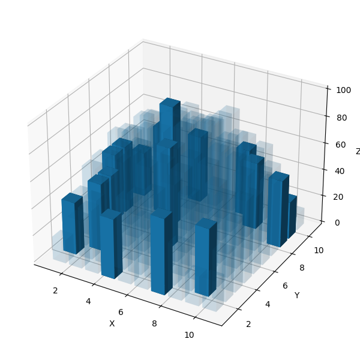
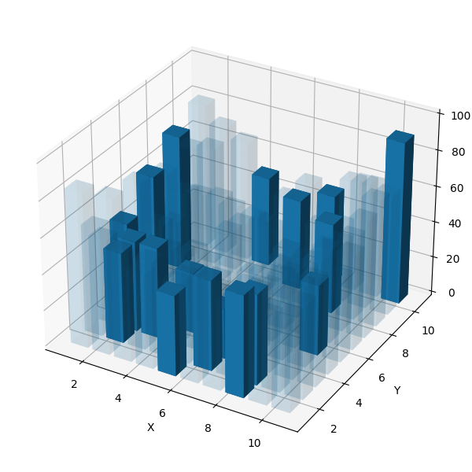
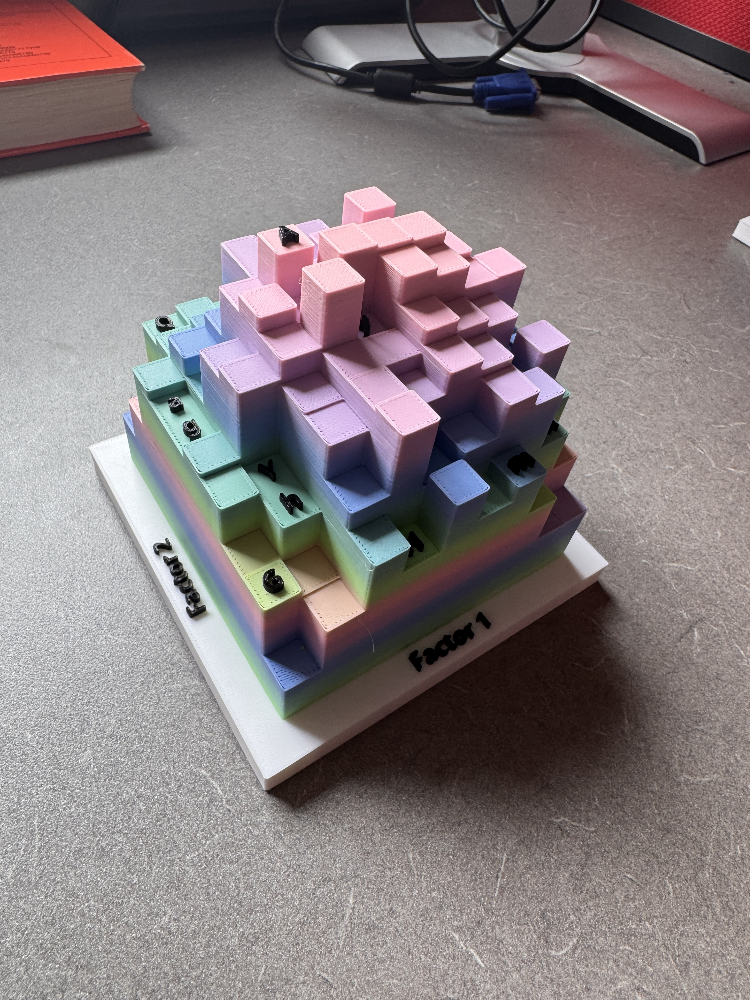
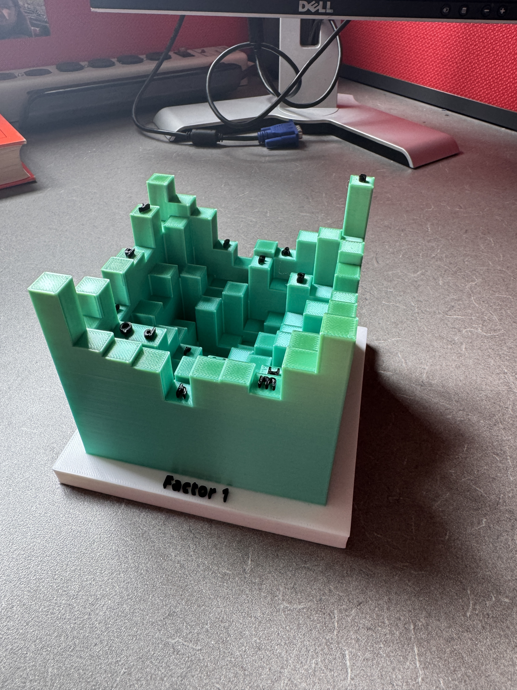

```{r}
#| message: false
#| warning: false
#| echo: false
library(tidyverse)
library(lme4)
library(lmerTest)
library(emmeans)
library(kableExtra)
```

## Introduction

In the 20th century, advancements in technology made data visualizations increasingly more affordable and accessible to a broader population. The primary change in formal data visualizations was from hand-drawn charts to computer-rendered charts [@tukey1965], yet other technological advances have allowed for data visualizations to enter other mediums. These include the ability to effectively use the 3-dimensional (3D) world around us with the novel use of 3D-printed charts. This newer type of visualization has gained a small amount of traction in recent years as a method of producing tangible charts [@stusak2015; @hu2015; @makingw2023]

At this time, there are few, if any, studies that evaluate 3D-printed charts for the purpose of displaying statistical information. This may in part be due to the cost of materials and rendering times as compared to charts produced on a computer. A single chart can take up to a day to print, limiting the ability to quickly produce visualizations. Given the nature of 3-dimensional data, viewing a 3D realization of statistical information in a 3D environment is a realistic scenario that could increase the ability for information extraction.

3D-printed visualizations have shown mixed or promising results across many disciplines. @katsioloudis2018 showed no evidence of a statistical difference in the method of 3D renderings when tasked with drawing a cross-sectional of a dodecahedron. This demonstrated that spatial awareness between computer-rendered and 3D-printed shapes is not largely different among engineering students. The use of 3D-printed maps for navigation for visually impaired persons showed positive feedback by @holloway2019, increasing the accessibility of navigation. In the clinical setting, 3D-printed anatomy structures were well accepted along with VR-glasses and 3D computer renderings [@muff2022]. With the rise of 3D-printed visualizations in scientific fields, we turn our attention to their use for statistical graphics.

### Literature Review

An identical dataset across multiple chart types does not ensure that the data is perceived in the same way [@cleveland1984; @hofmann2012; @vanderplas2020]. One of the main factors to this phenomena is with how data is encoded into the chart. These encodings include, but are not limited to, placement along axes, lengths, areas, volumes, and color scales. For example, bar charts and pie charts are two common visualizations that have long since been the topic of debate [@eells1926; @croxton1927; @cleveland1984]. In the case of bar charts and pie charts, encodings are represented by lengths and angles, respectively. Inherently, the comparison of different chart types is a comparison of encodings due to the changes in how data is being displayed.

@cleveland1984 noted that estimates involving numerical accuracy may decrease when increasing dimensionality of the encoding, although this was not formally tested in their experiments. The reasoning is possibly due to Stevens' power law, a mathematical formulation of how magnitudes are perceived given different stimuli sources [@stevens1986]. The general form of the law is $\psi(I)=kI^\alpha$, where $I$ is the magnitude of a stimulus, $\psi(I)$ is the perceived magnitude, $k$ is a proportionality constant from the unit of the stimulus, and $\alpha$ is the exponent from the type of stimuli used. Studies have estimated that lengths are perceived without bias (i.e., $\alpha=1$), but areas and volumes tend to have skewed perceptions [@cleveland1984]. This indicates that lower-dimensional charts might perform better when readers are tasked with extracting numerical estimates from the chart.

There are mixed results in regard to the use of 3D charts, mostly attributing to the purpose of third dimension. When the extra dimension does not convey meaningful information, estimates of accuracy decrease and solution times increase as compared to equivalent 2D charts [@fisher1997; @zacks1998; @fischer2000]. The same increase in solution time is seen when the third dimension is utilized for displaying data, but can sometimes produce better error rates than 2D charts [@barfield1989; @kraus2020]. Additionally, when given the option of 2D or 3D charts for extracting numerical information, the 2D charts showed increased preference and confidence than their 3D counterparts [@barfield1989; @fisher1997]. It is worth noting that all of these studies use 2D renderings of 3D charts and not physical 3D charts.

Formal studies involving true 3D charts are limited, and it is unclear if they follow the framework of existing theories on data visualizations. Unlike paper and computer rendered charts, constructing true 3D charts inherently contains many additional factors that could affect perception, such as chart materials, natural lighting, interactivity, and viewing distance. Some of these factors have already been shown to have an effect on computer renderings [@tarr2001; @wang2022].

We hypothesize that 3D charts in 3D environments will produce better information extraction than their computer rendered counterparts. Specifically, we will compare 3D-printed charts to digital 2D and 3D renderings. We suspect that this difference will hold across multiple data sets and different magnitudes of stimuli. In this paper, we evaluate the accuracy of numerical estimations on true 3D charts by conducting a factorial experiment that assessed chart types and ratios of pairs of stimuli. We discuss the construction of the stimuli and how we closely matched the charts to compare 2D, 3D-digital, and 3D-printed renderings of heat map data.

## Methods

Our study was designed to evaluate and expand the literature on numerical estimation of 3D charts. In our study, we focused on 2D and 3D heat maps, which we carefully construct to ensure that differences are contributed to the dimensionality of the chart. All of our data and methods are publically available for open science and reproducibility at <https://github.com/TWiedRW/ch3-heat3d>. In this section, we discuss process of designing our experiment and participant recruitment.

### Stimuli

We denote "stimuli" to represent the magnitude of our chosen values. In a 3D Cartesian space, the X- and Y- axes represent the coordinates of the stimuli, and the Z-axis represents the value for the stimuli. Each X and Y coordinate is represented by a square tile with a 1:1 aspect ratio. For a 2D space, the Z-axis is replaced by a color gradient scale. All stimuli and remaining randomly generated values range between 0 and 100 units. In this experiment, $X=1, 2, \dots,10$ and $Y=1, 2,\dots,10$.

The design of our experiment made use of the method of constant stimuli, where comparisons between stimuli are with respect to a stimuli that remains the same magnitude [@kingdom2016 chap. 3]. We set the constant stimuli at 50 units. For stimuli between 50 and 100, we set the maximum stimuli value at 90 and equally partitioned the ratios of stimuli with the constant stimuli, $\frac{50}{90}=0.556$ to $\frac{50}{50}=1.0$, resulting in 4 varying stimuli values where 50 is the smallest value. The same ratios obtained with stimuli between 50 and 90 were used to create 4 stimuli varying between 0 and 50, where 50 is the largest value. Additionally, we also included a stimuli pair where both values are 50, resulting in nine total pairs of stimuli. All stimuli values can be found in @fig-stimuli-values.

```{r}
#| fig-cap: "Values for stimuli in the heatmap experiment. All values are paired with the constant stimuli of 50 units, creating nine pairs of stimuli."
#| label: fig-stimuli-values
load('../../data/stimuli.rda')
stimuli %>% 
  ggplot(mapping = aes(x = pair_id, y = values)) + 
  geom_bar(stat = 'identity', width = 1, color = 'black', fill = '#1a80bb') + 
  geom_col(mapping = aes(y = 50), fill = '#ea801c', alpha = 1/3, width = 1/2) + 
  geom_text(aes(label = round(values, 1), y = 5)) + 
  theme_minimal() + 
  annotate('text', x = 5, y = 25, label = 'Constant', size = 2.5) +
  labs(x = 'Pair Label', y = 'Stimuli Magnitude') +
  scale_x_continuous(breaks = 1:9) + 
  scale_y_continuous(limits = c(0, 100)) +
  theme(panel.grid.major.x = element_blank(),
        panel.grid.minor.x = element_blank(),
        aspect.ratio = 1/2,
        panel.grid.major.y = element_line(color = 'grey70'),
        panel.grid.minor.y = element_line(color = 'grey80', linetype = 'dashed'))
```

To generate non-stimuli random values, we used a mixture distribution of random uniform noise and a mathematical function to populate our coordinate grid. The mathematical functions are scaled between 0 and 100, $g(Z)=100\cdot\frac{Z-\min(Z)}{\max(Z)-min(Z)}$. Two datasets were created for the experiment. The first dataset, called set 1, used the formula for the top half of sphere that is centered within our X and Y coordinate grid, $f_1(X,Y)=\sqrt{7^2-(X-\bar{X})^2-(Y-\bar{Y})^2}$, where $\bar{X}$ and $\bar{Y}$ are the averages of the $X$ and $Y$ coordinate ranges. The second dataset is calculated similarly using the formula for the bottom half of sphere, $f_2(X,Y)=\sqrt{7^2-(X-\bar{X})^2+(Y-\bar{Y})^2}$. Denoting $Z$ as the random values, $U(0,100)$ as a random variable drawn from a continuous uniform distribution between 0 and 100, and $X,Y$ as heatmap coordinates, our random heatmap data is calculated in @eq-random-z with $c=0.3$. An example of varying $c$ values is presented in @fig-random-z.

$$
Z=c\cdot U(0,100)+(1-c)\cdot g(f_i(X,Y))
$$ {#eq-random-z}

::: {#fig-random-z layout-ncol="5"}
{#fig-z100}

{#fig-z75}

{#fig-z50}

{#fig-z25}

{#fig-z0}

Mixture distribution of @eq-random-z using the formula for the top half of a sphere. As $c$ approaches 1, the distribution resembles uniform random noise.
:::

The placement of stimuli values onto the randomly generated heat map data was done via simulation to try to make their placement look as natural as possible. Twenty random heat maps were generated. For each heat map, the non-constant stimuli was placed onto the coordinate such that the difference between the stimuli and randomly generated value is minimized. The constant stimuli was then placed onto a coordinate within a Manhattan distance of three or four that minimizes the difference between the constant stimuli and randomly generated values, where the Manhattan distance is given by $|X_i - X_j| + |Y_i - Y_j|$ for stimuli $i$ and $j$. To ensure that stimuli placement is evenly position across the heat map, the count of stimuli was computed separately across the X and Y axes. For example, in Data Set 1, the X-axis has four stimuli in $X=1$, three stimuli in $X=2$, and so forth. Chi-squared statistics were calculated for each axis and the heat map with the smallest average Chi-squared statistic was selected as the final dataset. A visual inspection of this process showed that the stimuli were not clustered in any one area of the chart and that the stimuli look natural with respect to the random mixture distribution.

:::{#fig-placement layout-ncol=2}




Placement of stimuli on the two data sets. Bars with solid fills are the fixed stimuli values, where opaque bars are randomly generated.
:::

### Charts

Three types of charts were considered for this study: 2D-digital (2dd), 3D-digital (3dd), and 3D-printed (3dp). We constructed these charts so that they were as similar as possible, but inherent difference between dimensionality led to artistic decisions that attempt to focus solely on the dimensionality of the charts. The process of creating the charts is discussed in this section.

The 3D-printed charts were rendered with OpenSCAD [@kintelOpenSCADDocumentation2023]. To include plot text, a 120mm by 120mm by 10mm base was created with a solid color that was either white or black. Cells of the heatmap measured 10mm by 10mm, resulting in a heatmap that is 100mm by 100mm and is centered on the base. The upper bound of the height of heatmap values is 100mm, where 1-unit in the heatmap data is represented by 1mm of height on the heatmap. Once rendered, the heat map was saved to 3D Manufacturing Format (3mf) and Standard Triangle Language (stl) files. A variety of solid and gradient filaments were used to print the output files from OpenSCAD. An example of the 3D-printed chart is shown in @fig-3dp.

::: {#fig-3dp layout-ncol="2" fig-cap="3D printed heatmaps."}

{#fig-3dp-gradient}

{#fig-3dp-solid}

:::

To closely match the 3D-digital chart to the 3D-printed chart, multiple stl files were created for each colored component and combined with the RGL package [@rgl]. The base was rendered with white smoke (#F5F5F5) to slightly contrast with the default white background color (#FFFFFF). Heat map tiles were rendered with cyan (#74CCFF) and text labels were rendered with black (#000000). Lighting was fixed at 45 degree angles at two opposite corners of the chart. The end result was a near perfect replica of the 3D-printed charts, with the exception of different heat map tile colors, where an example is given in @fig-3dd.

{#fig-3dd fig-height="3in"}

Unlike the 3D charts, the 2D charts needed a different encoding to convey heat map values. The 2D heat maps were created with `ggplot2` [@ggplot2] using `geom_tile()`. Fill colors for the cells use a color gradient ranging from Blue Zodiac (#0C2841) to Malibu (#66D9FF), which were selected from a color picker using shadows on our initial 3D-printed charts. The color interpolation was performed with the `scale_fill_gradient()` function from the `ggplot2` package.

```{r}
#| fig-cap: "Color palette for 2D-digital charts. The colors are interpolated from #0C2841 to #66D9FF, which are the the colors of the lighting conditions for a 3D-printed chart created with cyan filament."
#| label: fig-color-pal
#| fig-height: 2
ggplot(mapping = aes(x = 1:10, y = 0)) + 
  geom_tile(color = NA, fill = colorRampPalette(c('#0C2841','#66D9FF'))(10)) + 
  theme_void() + 
  coord_equal()
```

### Subject Recruitment

::: callout-note
Take out the experiential learning part. This won't be talked about in this paper.
:::

Participants were recruited from all sections of STAT 218: *Introduction to Statistics* at the University of Nebraska-Lincoln from June 2025 to December 2025. The experiment was incorporated into the curriculum as a project that allowed students to get hands-on experience with statistics. Throughout the project, students were also given a series of reflections to evaluate their perspectives on statistics. The first reflection had gathered students' thoughts on the scientific process before participating in the experiment. After the experiment participation, students reflected on what they thought the experiment was measuring. Lastly, students were given a written article and video presentation of the experiment and asked how their view of the experiment changed from their initial perspectives of the experiment's purpose.

To assess whether students completed the experiment or not, the experiment produced a completion code for students to submit to Canvas. The completion code was created by concatenating three words with dashes (e.g., palm-raising-creatively). Words for the completion code came from the movie transcripts of the Star Wars prequel movies (Episodes 1, 2, and 3) as presented by [movies.fandom.com](movies.fandom.com). The movie transcripts were tokenism and filtered to remove colorful language[^index-1], stop words[^index-2], and fictional words[^index-3]. Instructors were provided an R script to check if their students completed the experiment, but the completion codes were not saved with any identifying information that could link experiment responses to student reflection responses.

[^index-1]: <https://www.cs.cmu.edu/~biglou/resources/bad-words.txt>

[^index-2]: tm package [@tm]

[^index-3]: @web2_dict

### Experimental Design

Our experiment was designed with a 3 x 2 x 9 treatment structure. Media type is our main interest, with 2D-digital, 3D-digital, and 3D-printed charts. To ensure that results are not confounded with datasets, we used two datasets to create the heatmaps. A total of 9 stimuli pairs were placed into each dataset. The order of treatments was given so that media and dataset combinations were grouped together randomly in the sequence and stimuli pairs were randomized within the groupings.

Due to practical constraints, stimuli pairs were incompletely blocked. A full factorial design would result in 54 trials per participant, which could lead to a decrease in quality responses [@herzog1981]. Therefore, we selected four out of the nine possible stimuli pairs to create incomplete blocks. This resulted in 18 blocks for a balanced incomplete block design. Within each block, media type is fully crossed with dataset. Using the incomplete block structure, participants completed a total of 24 trials, which is more practical than the full factorial design. Blocks were chosen for each participant by using probabilities that are proportional to the inverse counts of used blocks, meaning

We measured three responses – two questions for each trial and one question for each media by dataset combination. For each trial, participants are initially asked which stimuli in a pair is larger or if the stimuli are the same value. Next, they were asked to estimate the magnitude of the smaller stimuli if the larger stimuli represents 100 units, which is a subtractive process [@veit]. After each grouping of media and dataset, participants were presented with a modal dialog window asking them to rate their confidence on a 5-point Likert scale for their answers of the previous group of charts.

#### Shiny Application

A Shiny application [@shiny] was developed to administer the experiment. The application consisted of five sections: informed consent, demographics, practice, experiment, and wrap-up. The entire application is designed to be completed in approximately 30 minutes.

The Shiny application started with the informed consent screen, allowing participants to select if they are a STAT 218 Student and if they agree to the data collection. Participants had to select a data collection option to continue. After submitting their data collection response, a completion code was generated and saved on the last page of the application. A copy of the informed consent is available in our GitHub repository.

If participants agreed to have their data collected, they were presented with the demographics section. This section asked participants to use drop down menus to specify their age, gender identity, highest education level, and a question about how their participation in the experiment is graded. The last question was a text box and asked participants to specify their favorite movie and/or actor. Demographic information was combined with the application start time and completion code to create a hash for an anonymzed participant identifier using the `rlang` package [@rlang].

Once a participant completed the demographics page or selected "No" to the data collection question, participants were given a practice page. A modal dialog window was initially shown with instructions, and users could display this window again at any point during the practice. The practice consisted of four questions: two trials from 2dd charts and two trials from 3dd charts. Each practice trial showed the correct solution after the participant submits their trial. After all practice trials were completed, another modal dialog window was displayed to ask participants if they have access to the 3D-printed charts. This was necessary since the experiment was given to potentially online sections of STAT 218 who did not have access to the physical charts.

The experiment page was presented to participants after completion of the practice trials [@fig-exp-page]. Each page contained two questions -- one question for identifying which stimuli is larger and another question for estimating the value of the smaller stimuli if the larger stimuli is 100 units. If participants selected that the stimuli are the same value, then the slider was automatically placed at 100 units. Each trial has the slider initially placed at 50 units. An option was provided for displaying the coordinates of the stimuli pair on a 2D heatmap, but was left unchecked by default. For 3dd charts, the number of interactive clicks was also recorded. A trial could only be submitted if the first question is answered and if the slider was moved at least once.

{#fig-exp-page width="100%"}

After completing all trials, participants were given the completion code and informed to copy the code to Canvas since they will not have access to the code after closing out of the experiment.

#### Method of Analysis

The design of our experiment is a balanced incomplete split-plot with replication, where media type and dataset is the whole plot and stimuli pair is the split plot. A similar design was presented by @mandal2020 for a single replicate. For our experiment, the ANOVA table is in [@tbl-anova].

| Source                                          | Degrees of Freedom    |
|-------------------------------------------------|-----------------------|
| Block (B)                                       | 18-1                  |
| Media type (M)                                  | 3-1                   |
| Data Set (D)                                    | 2-1                   |
| Whole-plot error = $B\times M \times D$         | (18-1)(3-1)(2-1)      |
| Stimuli Pair (P)                                | 9-1                   |
| $P\times M$                                     | (9-1)(3-1)            |
| $P\times D$                                     | (9-1)(2-1)            |
| $P\times M \times D$                            | (9-1)(3-1)(2-1)       |
| Split-plot error = $B\times M\times D \times P$ | (18-1)(3-1)(2-1)(9-1) |

: ANOVA table for analysis of a single replicate of the balanced incomplete split-plot. {#tbl-anova}

The first question for each trial was to indicate which value within a stimuli pair was larger, or if they were the same value. Since a participant could either answer this question correctly or incorrectly, a Binomial generalized linear mixed model [@stroup] was fit to the responses.

To measure numerical accuracy of participant responses for the second question in each trial, we used the absolute value of the difference between the participant estimate of the smaller stimuli value and its true value. By using the absolute value of the error, we measure how far off a participant's estimate was rather than the direction of error. For numerical accuracy, we fit a linear mixed model. If the responses do not fit well to a Gaussian distribution, other distributions, such as the log-normal or gamma distributions, will be used for a generalized linear mixed model.

$$
Y=|\text{Guess}-\text{Actual|}
$$

```{r}
#| eval: false
#| echo: false
results <- data.frame()

for(i in 1:18){
  for(j in 1:3){
    results <- bind_rows(results, mutate(randomize_order(i, plan, F), block = i, id = j))
  }
}

dat <- results %>% 
  mutate(y = rnorm(nrow(.), 50, 3),
         pair_id = factor(pair_id),
         block = factor(block)) %>% 
  rowwise() %>% 
  mutate(id = rlang::hash(paste0(block, id)))
         
library(lme4)
library(lmerTest)
mod <- lmer(y ~ (1|block) + set + media + set:media +(1|block:set:media) + pair_id + pair_id:set + pair_id:media + pair_id:set:media, data = dat)
anova(mod)
summary(mod)

```

In addition to linear mixed models, we used the bootstrap distribution of mean errors as described by @cleveland1984 to provide empirical claims for the effect of dimensionality. A common issue in experiments involving perception is that random noise often covers the effects of interest, so the empirical claims may provide additional insight into the effect of chart dimensionality (XXX).

After each media type and data set grouping, participants were given a question to rate their confidence on their answers. Here, we use descriptive statistics and visualizations to assess confidence across our treatment factors.

## Results

### Demographics

```{r}
#| message: false
#| echo: false
#| warning: false

set.seed(3141)

# Data from Shiny app
library(RSQLite)
conn <- dbConnect(SQLite(), "../../shiny-apps/experiment-heat3d/data/stat218-summer2025.db")
dbListTables(conn)
blocks <- dbReadTable(conn, "blocks")
exp_results <- dbReadTable(conn, "exp_results")
users <- dbReadTable(conn, "users")
dbDisconnect(conn)

# Solutions
solutions <- readRDS("../../data/solutions.rda")

library(tidyverse)
# Pre-processing of results
results <- exp_results %>%
  
  # Remove all practice trials
  filter(set != "practice") %>%
  
  # Arrange by user id and trial time
  group_by(user_id) %>%
  arrange(start_time) %>%
  
  # Identify sequence of trials
  mutate(user_seq = ifelse(user_trial_order > lag(user_trial_order), 0, 1),
         user_seq = ifelse(start_time == min(start_time), 0, user_seq)) %>% 
  mutate(user_seq = cumsum(user_seq)) %>%
  
  # Join with blocks
  left_join(blocks, by = "user_id", relationship = 'many-to-many') %>%
  
  # Remove blocks that were assigned after the trials started
  group_by(user_id, user_seq) %>%
  filter(system_time < min(start_time)) %>%
  
  # Get time difference with block and filter for smallest difference
  mutate(time_diff_block = min(start_time) - system_time) %>%
  filter(time_diff_block == min(time_diff_block)) %>% 
  
  # Filter so that only the first completed trial is included
  filter(user_seq == min(user_seq))

# Get user sequences with full completions
full_completions <- results %>% 
  group_by(user_id, user_seq, block) %>%
  count() %>%
  filter(n %in% c(16,24))

# Inner join to filter
results <- inner_join(results, full_completions) %>%
  select(-c(time_diff_block, n)) %>% 
  ungroup()

# Join with results and filter so that only first completed block is there
results <- left_join(results, solutions) %>% 
  ungroup() %>% 
  group_by(user_id) %>% 
  filter(system_time == min(system_time)) %>% 
  ungroup() %>% 
  filter(between(as_datetime(system_time), as_date('2025-08-01'), as_date('2025-12-31'))) %>% 
  mutate(target_ratio = 100*true_ratio,
         target_size = ifelse(z > 50, 50, z*true_ratio),
         target_diff = z-target_size)

results$pair_id <- factor(results$pair_id)

# All instances of starting the experiment
all_starts <- inner_join(blocks, users) %>% 
  filter(!str_detect(tolower(user_unique), 'test,'))

```

```{r}
# Combine users and results, remove all "test" entries
users_clean <- results %>% 
  inner_join(users, by = 'user_id', relationship = 'many-to-many') %>% 
  select(user_id, user_age:user_unique) %>% 
  distinct() %>% 
  dplyr::filter(!str_detect(tolower(user_unique), 'test,'))
```

```{r}
# Get in-person users (have at least 1 3dp trial)
users_in_person <- users_clean %>% 
  inner_join(results) %>% 
  group_by(user_id, media) %>% 
  summarise(n = n()) %>% 
  filter(media == '3dp' & n > 0) %>% 
  select(user_id)
```

Our experiment was conducted with eight sections of Stat 218 between August 25th and December 19th in 2025 at the University of Nebraska. To participant in the experiment, students were instructed to visit communal office hour locations to access the 3D printed charts. We recorded `r nrow(all_starts)` interactions with the shiny application, of which `r nrow(users_clean)` students completed the entirety of the experiment. Of these students, `r nrow(users_clean)-nrow(users_in_person)` were enrolled in online sections of the course and did not have access to the 3D printed charts. The vast majority of participants were actively completing their undergraduate degree and between the ages of 19 and 25. **SEE TABLE**

```{r}
tbl_gender <- users_clean %>% 
  group_by(user_gender) %>% 
  count() %>% 
  pivot_wider(names_from = user_gender,
              values_from = n)

tbl_age <- users_clean %>% 
  group_by(user_age) %>% 
  count() %>% 
  pivot_wider(names_from = user_age,
              values_from = n)

tbl_education <- users_clean %>% 
  group_by(user_education) %>% 
  count() %>% 
  pivot_wider(names_from = user_education,
              values_from = n) %>% 
  select(`High School or Less`,`Some Undergraduate Courses`,`Undergraduate Degree`,`Some Graduate Courses`,`Graduate Degree`,`Prefer not to answer`)

```

**DEMOGRAPHICS TABLE**

During our initial exploration of the results, we discovered a non-negligible number of students who did not follow the instructions. In some cases, participants appeared to using alternative estimation strategies, such as estimating the difference between the two values in a stimuli pair. Additionally, we noticed that several students were randomly entering values in order to obtain the completion code at the end of the experiment. We provide some examples of individual participant responses in @fig-user-strategies to illustrate this issue.

```{r}
#| fig-width: 6
#| fig-height: 4
#| fig-dpi: 600
#| fig-cap: "Three potential estimation strategies from participants. Many participants followed instructions to estimate ratios. However, some participants appeared to estimate the difference between stimuli pairs or submitted random values."
#| label: fig-user-strategies

# results %>% 
#   group_by(user_id) %>% 
#   summarize(corr_ratio = cor(user_slider, target_ratio)) %>% 
#   arrange(-corr_ratio)

results %>% 
  filter(user_id %in% c(
    '773966d68f5e13e119b6d13c8f16a68e', #Ratio
    '9fd7c7ca2fa26afd0b2ab532442a27c0', #Diff
    '78ec9b96ed3ccdd7c796dd2010aebd5b'  #Random
  )) %>% 
  mutate(strategy = case_when(
    user_id == '773966d68f5e13e119b6d13c8f16a68e' ~ 'Ratio Strategy',
    user_id == '9fd7c7ca2fa26afd0b2ab532442a27c0' ~ 'Difference Strategy',
    user_id == '78ec9b96ed3ccdd7c796dd2010aebd5b' ~ 'Random Strategy'
  )) %>% 
  mutate(target = case_when(
    user_id == '773966d68f5e13e119b6d13c8f16a68e' ~ target_ratio,
    user_id == '9fd7c7ca2fa26afd0b2ab532442a27c0' ~ target_diff,
    user_id == '78ec9b96ed3ccdd7c796dd2010aebd5b' ~ 50
  )) %>% 
  ggplot(mapping = aes(x = user_trial_order, y = user_slider, group = user_id)) + 
  geom_col(aes(y = 100, fill = media), alpha = 1/5, color = NA, width = 1) + 
  geom_line(aes(linetype = 'user'), alpha = 1) + facet_wrap(~strategy, scales = 'free_x', nrow = 2) + 
  geom_point() + 
  scale_x_continuous(breaks = seq(1,24, by = 4)) +
  geom_line(aes(y = target, linetype = 'suspect'), alpha = 2/3) +
  geom_line(aes(y = target_ratio, linetype = 'target'), alpha = 2/3) +
  scale_linetype_manual(labels = c('User response', 'True target', 'Suspected target'),
                        values = c('user'='solid','suspect'='dotted','target'='dashed'),
                        breaks = c('user', 'target', 'suspect')) +
  labs(x = 'Trial Number', y = 'Slider Position\n(0 - 100)',
       fill = 'Chart Type', linetype = 'Strategy') + 
  theme_bw() + 
  theme(panel.grid.major.x = element_blank(), panel.grid.minor.x = element_blank())
```

It is commonly acknowledged in psychology that careless respondents should be addressed to some degree, although there is no general consensus on how to handle this in recent years [@jasoIdentificationCarelessResponding2021; @ward2023]. Some proposed solutions include removing participants based on observed patterns or to fit mixture models to address latent class variables. In this section, we discuss one possible subset of participant responses to address careless respondents. We also include the models of several other subsets in the appendix.

```{r}
res_q1 <- results %>% 
  inner_join(users_clean, by = 'user_id') %>% 
  mutate(q1 = case_when(
    user_larger == 'Both values are the same' ~ 'Equal',
    (user_larger != true_larger) & (user_larger != 'Both values are the same') ~ 'Smaller',
    user_larger != 'Both values are the same' & user_larger == true_larger ~ 'Larger'
  ), correct_label = ifelse(user_larger == true_larger, '*', NA)) %>%
  mutate(q1_label = factor(q1, labels = c('Smaller value\n(or incorrect)', 
                                          'Equal', 'Larger value'), 
                           levels = c('Smaller', 'Equal', 'Larger'), ordered = T),
         prop = round(100*true_ratio,1),
         facet_label = paste0('Stimuli Pair ', pair_id, ' (', prop, '%)'),
         q1 = factor(q1, levels = c('Smaller', 'Equal', 'Larger'), ordered = F))

res_q1_filtered <- res_q1 %>% 
  filter(pair_id != 5) %>% 
  group_by(user_id) %>% 
  summarize(n_trials = n(),
            n_correct = sum(user_larger == true_larger),
            p.value = pbinom(n_correct, size = n_trials, prob = 2/3, lower.tail = F)) %>% 
  ungroup() %>% 
  filter(p.value <= 0.05)
```

### Addressing Random Categorical Responses

To improve the quality of our data, we started by assessing random guesses in identifying the larger value of a stimuli pair. In each trial, participants have a 1/3 probability of correctly identifying the larger value if they are randomly guessing. Since stimuli pair 5 is identical values, we temporarily exclude those trials to focus on stimuli pairs where there was a difference between the values. For each participant, we test $H_0: \pi\leq2/3\text{ vs. }H_1:\pi>2/3$ with $\alpha=0.05$, where $\pi$ is the probability of a participant correctly answering the initial question and $\alpha$ is the level of the test. Using the first question for participant screening, `r nrow(res_q1) - nrow(res_q1_filtered)` participants are excluded for suspected random selecting, leaving `r nrow(res_q1_filtered)` participants. The effect of this exclusion can be seen in @fig-q1-eda.

::: callout-note
$\pi=0.5$ or $\pi=2/3$ for the test? 39 additional participants are excluded for the higher proportion
:::

```{r}
#| label: fig-q1-eda
#| fig-cap: "Proportion of correct responses to Question 1 across stimuli pairs and media types. For all pairs, with the exception of Pair 5, a correct answer was 'Larger value'. Stimuli Pair 5 had two identical values, XXXXX"
#| fig-subcap:
#| - "No participant filtering"
#| - "Exclude random guessers"
res_q1 %>% 
  ggplot(mapping = aes(y = media, fill = q1_label)) + 
  geom_bar(position = position_fill()) + 
  labs(x = 'Proportion', y = 'Media type', fill = 'Participant Selection') + 
  facet_wrap(~facet_label) + 
  scale_fill_manual(values = c(
    'Larger value' = '#2066a8',
    'Equal' = '#3594cc',
    'Smaller value\n(or incorrect)' = '#8cc5e3'
  )) + 
  theme_bw() + 
  theme(aspect.ratio = 1/3,
        panel.grid = element_blank(),
        legend.position = 'bottom')

res_q1 %>% 
  inner_join(res_q1_filtered) %>% 
  ggplot(mapping = aes(y = media, fill = q1_label)) + 
  geom_bar(position = position_fill()) + 
  labs(x = 'Proportion', y = 'Media type', fill = 'Participant Selection') + 
  facet_wrap(~facet_label) + 
  scale_fill_manual(values = c(
    'Larger value' = '#2066a8',
    'Equal' = '#3594cc',
    'Smaller value\n(or incorrect)' = '#8cc5e3'
  )) + 
  theme_bw() + 
  theme(aspect.ratio = 1/3,
        panel.grid = element_blank(),
        legend.position = 'bottom')
```

### Analysis of Error

We define our error metric as follows:

$$
y=\log_2(|\text{User Response}-100\times(\text{True ratio})|+1/8)
$$

In our analysis, we excluded responses where participants were incorrect in their response to the initial question and all trials for stimuli pair 5. The initial question served as an attention check to verify that the participants were making the correct comparison between stimuli values. The removal of stimuli pair 5 is due to the

```{r}
res_q2 <- results %>%
  mutate(q2_error = user_slider - target_ratio,
         q2_error_cm = log2(abs(user_slider - target_ratio) + 1/8))
res_q2_filtered <- res_q2 %>% inner_join(res_q1_filtered)

mod_q2 <- lmer(q2_error_cm ~ set*media*pair_id + (1|user_id:block/set:media),
               data = filter(res_q2_filtered, pair_id != 5 & user_larger==true_larger))
mod_q2_anova <- car::Anova(mod_q2, type = 3, test = 'F')
p.vals_mod2 <- mod_q2_anova$`Pr(>F)`
```

With our specified exclusion criteria, we find that was marginal evidence for the effects of chart type (p-value = `r round(p.vals_mod2[3], 3)`) and the data set and stimuli pair interaction (p-value = `r round(p.vals_mod2[6], 3)`). This finding is mostly consistent with the other models presented in the appendix.

```{r}
#| echo: false
em <- emmeans(mod_q2, ~media, infer = c(T,T))
diffs <- pairs(em, infer = c(T,T))
diffs
```

Our findings showed that the 2D heat maps had evidence of higher log absolute error than both types of the 3D heat maps. On the log scale, the error for 2D heat maps was larger than the error for digital 3D heat map by 0.41364 (95% CI: 0.253, 0.574). This finding is similar for the 3D printed heat maps, where the log absolute error for 2D heat maps was larger by 0.41261 (95% CI: 0.234, 0.591). There were no detectable differences in error between the digital and physical 3D heat maps (p-value = 0.9999).

<!-- I cant seem to figure out how to extract these values from the code above :( -->

```{r}
library(ggsignif)
em %>% 
  data.frame() %>% 
  ggplot(mapping = aes(x = media, y = emmean)) + 
  geom_col() + 
  geom_signif(
    comparisons = list(c('2dd', '3dd'), c('2dd', '3dp')),
    margin_top = 0.4,
    step_increase = 0.5,
    tip_length = 0.3
  ) + 
  theme_bw() + 
  theme(aspect.ratio = 1)

```

```{r}

em2 <- emmeans(mod_q2, ~pair_id + set)
em2

pairs(em2) %>% 
  data.frame() %>% 
  separate(contrast, into = c('p1','p2'), sep = ' - ') %>% 
  pivot_longer(cols = c(p1, p2)) %>% 
  filter(p.value <= 0.05) %>% 
  group_by(value) %>% 
  count() %>% 
  arrange(-n)

pairs2 <- pairs(em2) %>% 
  data.frame() %>% 
  filter(p.value < 0.05) %>% 
  arrange(p.value)
```

When examining the interaction between stimuli pairs and underlying datasets, `r nrow(pairs2)` differences in log absolute error were detected at the $\alpha=0.05$ level. Seven of these differences occurred with stimuli pair 6 (ratio = 0.889) and dataset 1, which had the smallest estimated marginal mean of log absolute error. All differences can be found in @fig-em-set-pair, where significant differences are assessed via a compact letter display from the `multcomp` package [@multcomp].

```{r}
#| fig-cap: "Estimated marginal means of stimuli pair and dataset. Bars sharing the same letter are not significantly different from one another."
#| label: fig-em-set-pair
multcomp::cld(em2, Letters = letters) %>% 
  data.frame() %>% 
  left_join(mutate(solutions, pair_id = as.factor(pair_id))) %>% 
  mutate(label = paste0('Pair ', pair_id, '\n(', round(100*true_ratio, 1), '%)')) %>% 
  ggplot(mapping = aes(x = reorder(label, emmean, mean), y = emmean)) + 
  labs(x = '', y = 'Estimated Margial Mean\nlog2(|Error|) + 1/8', fill = 'Dataset') +
  geom_col(aes(fill = set), position = position_dodge(), width = 2/3) + 
  geom_text(aes(label = trimws(.group), y = 0.2, color = set), position = position_dodge(2/3),
            angle = 0,
            hjust = 0.5,
            size = 2) +
  geom_errorbar(aes(ymin = lower.CL, ymax = upper.CL, color = set),
                position = position_dodge(2/3), width = 1/4) +
  scale_color_manual(values = c('set1' = 'black', 'set2' = 'black')) +
  scale_fill_manual(values = c('set1' = '#1a80bb', 'set2'='#8cc5e3')) + 
  guides(color = 'none') +
  theme_bw() + 
  theme(aspect.ratio = 1/2)
```

An interesting observation from the stimuli pairs and dataset interaction is from the non-detectable differences. We note that no differences were detected across datasets for a given stimuli pair, as well as for stimuli pairs and datasets with identical ratios.

````{=html}
<!--- Honestly not sure if I want to have this section. While it would be nice to have a similar result to CM, the design of the experiment was different.

### A 1980s bootstrap

In addition to our contemporary mixed effects model, we present results following the bootstrap procedure as described by @cleveland1984. To account for the complex correlation between judgements, 1,000 bootstrap samples of size `r length(unique(res_q2_filtered$user_id))` were drawn from the sample of `r length(unique(res_q2_filtered$user_id))` participants with replacement. In each sample, midmeans were computed for each combination of chart type, dataset, and stimuli pair. Means and confidence intervals of the bootstrap sampling are presented in @fig-bootstrap-95, where 95% confidence intervals are calculated as the mean of midmeans plus and minus 1.96 times the standard deviation of the midmeans. 


```{r}
#| eval: false
set.seed(213)
bootstrap <- data.frame()
for(i in 1:1000) {
  one_sample <- res_q2_filtered %>% 
    filter(user_larger==true_larger & pair_id != 5) %>% 
    group_by(user_id, block) %>% 
    nest() %>% 
    ungroup() %>% 
    slice_sample(prop = 1, replace = T) %>% 
    arrange(user_id) %>% 
    unnest(data) %>% 
    group_by(media, pair_id, set) %>% 
    summarize(midmean = mean(q2_error_cm, trim = 0.25), .groups = 'keep') %>% 
    mutate(sample = i)
  bootstrap <- bind_rows(bootstrap, one_sample)
}
```


```{r}
#| eval: false
#| fig-width: 6
#| fig-height: 4
#| fig-dpi: 1200
#| fig-cap: "Log absolute error means and 95% confidence intervals using bootstrap sampling. "
#| label: fig-bootstrap-95
bootstrap %>% 
  group_by(media, pair_id, set) %>% 
  summarize(mean = mean(midmean),
            sd = sd(midmean)) %>% 
  ggplot(mapping = aes(y = media, x = mean)) + 
  geom_point(size = 0.5) + 
  geom_errorbar(aes(xmin = mean-1.96*sd, xmax = mean+1.96*sd), width = 1/4) + 
  labs(x = 'Log2 (Absolute Error + 1/8)', y = 'Chart type') + 
  facet_grid(set ~ pair_id, labeller = label_both) + 
  scale_x_continuous(breaks = seq(0,10, by = 1)) + 
  theme_bw() +
  theme(aspect.ratio = 1, 
        axis.text.x = element_text(size = 6),
        panel.grid.major.x = element_blank(),
        panel.grid.minor.x = element_blank())

```

The procedure for calculating 95% confidence intervals for pairwise differences is defined as follows. .... **FINISH THIS SECTION**

```{r}
#| eval: false
df_midmeans_wide <- bootstrap %>%
  mutate(trt = paste(media, pair_id, set, sep = '_')) %>% 
  select(sample, trt, midmean) %>% 
  pivot_wider(names_from = trt, values_from = midmean)

mat_midmeans <- as.matrix(df_midmeans_wide[,-1])
mat_means <- colMeans(mat_midmeans)
trt_names <- colnames(mat_midmeans)

all_combs <- combn(trt_names, 2)

pairwise <- data.frame()

for(i in 1:ncol(all_combs)) {
  tmp_diff_trts <- all_combs[,i]
  tmp_mean_diffs <- as.numeric(mat_means[tmp_diff_trts[1]] - 
                                 mat_means[tmp_diff_trts[2]])
  tmp_all_diffs <- as.numeric(mat_midmeans[,tmp_diff_trts[1]] - 
                                 mat_midmeans[,tmp_diff_trts[2]])
  sd_ij <- sd(tmp_all_diffs)
  
  lhs <- abs(tmp_mean_diffs - tmp_all_diffs)
  tmp_df <- data.frame(
    contrast = paste(tmp_diff_trts, collapse = ' - '),
    lhs = lhs,
    sd_ij = sd_ij
  )
  
  pairwise <- bind_rows(pairwise, tmp_df)
  
}

# Find c
pairwise %>% 
  summarize(mean(lhs <= sd_ij))

c_many <- seq(1.929293, 2.090909, l = 100)

expand_grid(pairwise, c_many) %>% 
  group_by(c_many) %>% 
  summarise(prop_true = mean(lhs<=c_many*sd_ij)) %>% 
  mutate(c_many = round(c_many, 2))


```


The value for $c$ such that 95% of pairwise differences was computed to be 1.96. 


--->
````

```{r}
res_q2 <- results %>%
  mutate(q2_error = user_slider - target_ratio,
         q2_error_cm = log2(abs(user_slider - target_ratio) + 1/8))
res_q2_filtered <- res_q2 %>% inner_join(res_q1_filtered)

mod <- lmer(q2_error_cm ~ set*media*pair_id + (1 | user_id:block/set:media),
     data = filter(res_q2_filtered, pair_id != 5 & user_larger==true_larger))
summary(mod)

hist(residuals(mod, type = 'pearson'))

plot(mod)

```

### Application interactions (time + clicks)

```{r}
time <- res_q2_filtered %>% 
  ungroup() %>% 
  mutate(ttc = end_time - start_time)
clicks <- res_q2_filtered %>% 
  filter(media == '3dd')

over_60 <- time %>% 
  filter(ttc >=60) %>% 
  group_by(user_id, block) %>% 
  count() %>% 
  arrange(-n)
```

In this section, we describe participant interactions with the Shiny application using the same participant exclusion criteria as our model. As participants completed the experiment, we recorded the amount of time to complete each trial, the number of cursor clicks on the digital 3D heat maps, and the number of times that the slider was moved.

Many participants completed each trial in under 20 seconds. The median completion time was `r median(time$ttc)` seconds, with a standard deviation of `r sd(time$ttc)` seconds. There were `r nrow(over_60)` participants who had at least one trial exceed 60 seconds. Due to the design of the administration of the experiment, we are unable to account for the cause of longer trial completion times.

```{r}
#| fig-cap: "Visual summary of time spent on each trial. 137 trials are ommitted due to lasting longer than 60 seconds."
#| fig-subcap:
#| - "Frequency plot"
#| - "Time vs. Error"
#| label: fig-time-summary
#| layout-ncol: 2
time %>% 
  ggplot(mapping = aes(x = ttc, color = media)) + 
  geom_density() + 
  scale_x_continuous(limits = c(0, 60)) + 
  labs(x = 'Time spent per trial\n(in seconds)',
       color = 'Chart type') + 
  theme_bw() + 
  theme(aspect.ratio = 1)
  
time %>% 
  ggplot(mapping = aes(x = ttc, y = q2_error_cm, color = media)) + 
  geom_point(alpha = 1/5) + 
  geom_smooth() +
  scale_x_continuous(limits = c(0, 60)) + 
  labs(x = 'Time spent per trial\n(in seconds)',
       y = 'log2(|Error|+1/8)',
       color = 'Chart type') + 
  theme_bw() + 
  theme(aspect.ratio = 1)
```

```{r}
clicks %>% 
  ggplot(mapping = aes(x = clicks_3dd)) + 
  geom_histogram(binwidth = 1, color = 'black', fill = '#1a80bb') + 
  theme_bw() + 
  theme(aspect.ratio = 1)

clicks %>% 
  ggplot(mapping = aes(x = clicks_3dd, y = q2_error_cm)) + 
  geom_point(position = position_jitter(width = 1/5, height = 0), alpha = 1/10) + 
  geom_smooth() +
  # scale_x_log10() +
  theme_bw() + 
  theme(aspect.ratio = 1)
```

```{r}
res_q2_filtered %>% 
  ggplot(mapping = aes(x = slider_clicks)) + 
  geom_histogram(binwidth = 1, fill = '#1a80bb', color = 'black') + 
  theme_bw() + 
  theme(aspect.ratio = 1)

res_q2_filtered %>% 
  ggplot(mapping = aes(x = slider_clicks, y = q2_error_cm)) + 
  geom_point(position = position_jitter(width = 1/5, height = 0), alpha = 1/10) +
  geom_smooth() +
  theme_bw() + 
  theme(aspect.ratio = 1)
```

```{r}
res_q2_filtered %>% 
  ggplot(mapping = aes(x = slider_start, y = user_slider)) + 
  geom_point(alpha = 1/10) +
  geom_smooth() +
  theme_bw() + 
  theme(aspect.ratio = 1)
```

## Discussion and Conclusion

Our study was designed to test the numerical estimation of ratios in 2D and 3D heat maps rendered in digital and physical environments. The current state of tangible statistical graphics is limited mainly to tactile displays, whereas 3D printed statistical graphics are largely unexplored. We found that when the third dimension is conveying meaningful information, the heights of 3D heat maps had smaller errors than the color gradient of 2D heat maps. No differences were detected between the digital and physical 3D heat maps, which is perhaps attributed to the exact one-to-one design relationship between the digital display and the 3D printed chart.

## Future work

::: callout-note
With all of the challenges we faced in designing this experiment, I feel like there is a lot of potential future work.

-   Tools for creating 3D printed charts
-   Many different types of chart parameters
:::

## Appendix

**Models yet to come**
